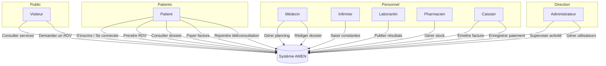
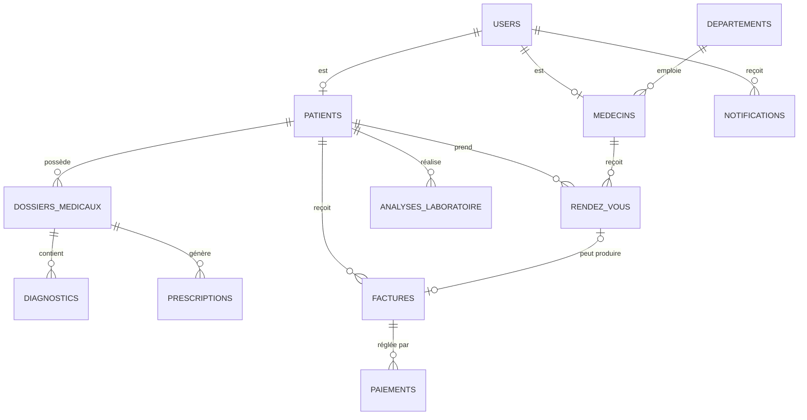
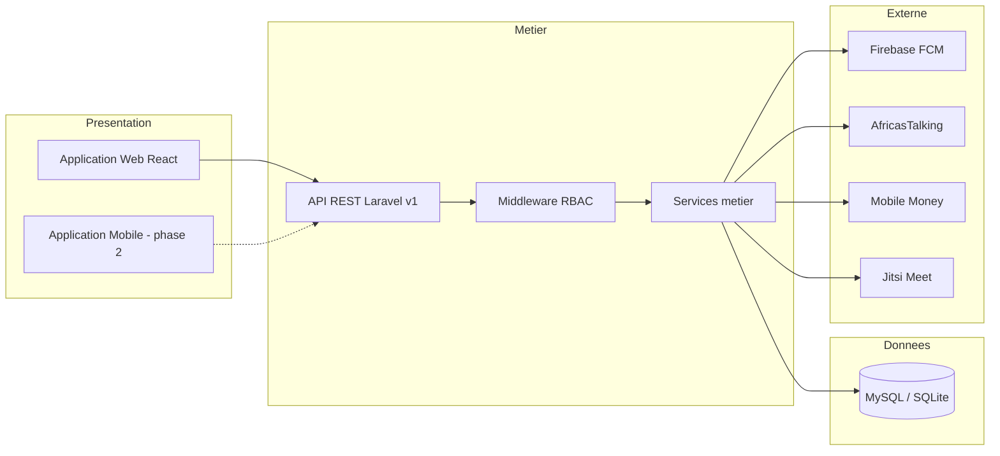
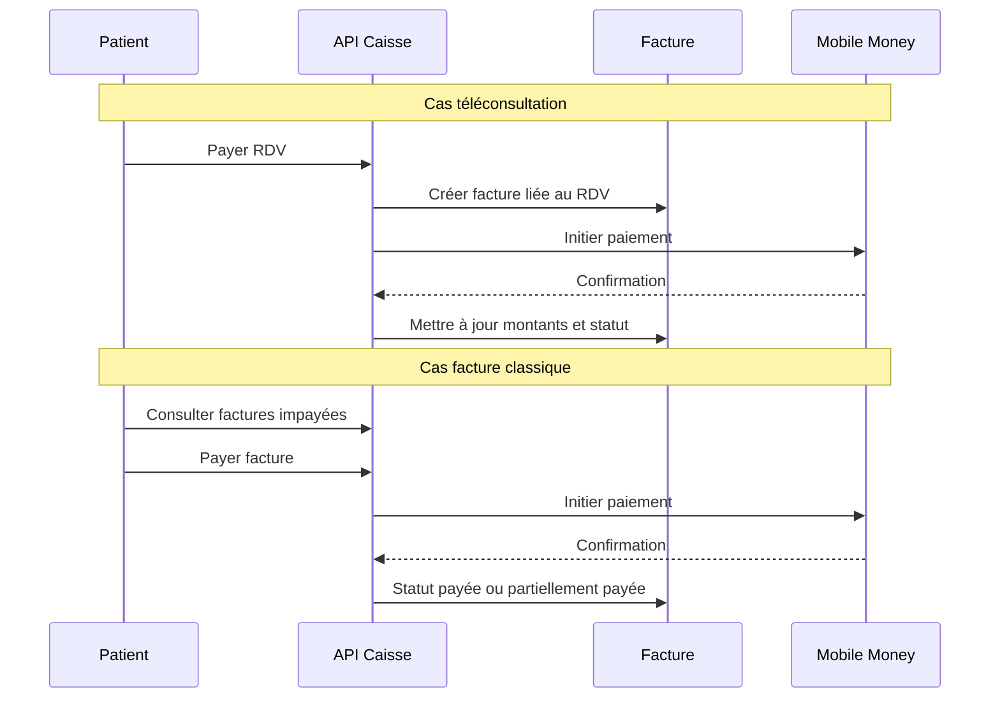

# CHAPITRE I — CONCEPTION DU SYSTÈME D'INFORMATION HOSPITALIER

## Centre Médical AMEN — FOSPHA ONGD/ASBL, Kinshasa (RDC)

**Travail de fin de cycle (L3 LMD)**  
**Thème :** Conception et implémentation d'une application hybride de digitalisation hospitalière  
**Dépôt du code source :** [https://github.com/Exauce09/TFC-ENGWELE](https://github.com/Exauce09/TFC-ENGWELE)

---

## Introduction du chapitre

La conception constitue l'étape fondatrice de tout projet informatique à fort enjeu social. Dans le domaine de la santé, elle ne se limite pas au choix d'un langage de programmation ou d'un framework : elle traduit d'abord une compréhension fine des processus cliniques, administratifs et financiers d'un établissement, puis propose une organisation cohérente des données, des acteurs et des échanges informationnels.

Le présent chapitre expose la démarche de conception retenue pour la digitalisation du **Centre Médical AMEN**, structure de soins gérée par **FOSPHA ONGD/ASBL** à Kinshasa, en République Démocratique du Congo. Il décrit le contexte organisationnel, la problématique, les besoins exprimés, les acteurs concernés, la modélisation des données, l'architecture technique envisagée, les principes de sécurité ainsi que les choix structurants qui orientent l'implémentation décrite dans le chapitre suivant.

L'ambition du système est de proposer une **application hybride** : une plateforme web immédiatement exploitable par le personnel et les patients, adossée à une API unique destinée à accueillir ultérieurement une application mobile. Cette orientation « API first » garantit la pérennité de l'investissement logiciel et la cohérence des données entre canaux d'accès.

---

## I.1 Contexte et problématique

### I.1.1 Présentation de l'organisme d'accueil

Le Centre Médical AMEN est un établissement de soins de proximité qui assure des prestations couvrant plusieurs spécialités : médecine générale et interne, pédiatrie, gynécologie, ophtalmologie, urgences, maternité, laboratoire, pharmacie, soins infirmiers, ainsi que des activités paramédicales complémentaires (échographie, kinésithérapie, dentisterie, chirurgie).

L'activité quotidienne mobilise une diversité de profils — patients, médecins, infirmiers, laborantins, pharmaciens, caissiers, réceptionnistes et administrateurs — dont la coordination repose encore largement sur des supports papier, des registres manuels et des échanges téléphoniques ou oraux.

### I.1.2 Constats sur le fonctionnement actuel

L'analyse du fonctionnement actuel du centre met en évidence plusieurs limites récurrentes dans les établements de santé de taille moyenne en milieu urbain congolais :

1. **Fragmentation de l'information** : le dossier du patient est dispersé entre le registre d'accueil, les feuilles de consultation, les bulletins de laboratoire, les ordonnances et les reçus de caisse. La reconstitution d'un parcours de soins demande un effort manuel important.

2. **Lenteur et erreurs dans la prise de rendez-vous** : les demandes sont enregistrées sur papier ou par téléphone, sans visibilité centralisée sur les disponibilités des médecins ni sur la charge par département.

3. **Traçabilité financière insuffisante** : la facturation et les encaissements (espèces, Airtel Money, M-Pesa) ne sont pas toujours reliés de manière systématique aux actes médicaux réalisés, ce qui complique le suivi des impayés et la production de statistiques.

4. **Communication patient-établissement limitée** : les rappels de rendez-vous, la disponibilité des résultats d'analyses ou les confirmations de paiement dépendent d'appels individuels, coûteux en temps et peu fiables.

5. **Absence d'outil numérique unifié** : chaque service fonctionne avec ses propres habitudes, sans passerelle commune ni règles d'accès formalisées aux données sensibles.

### I.1.3 Problématique

Comment concevoir un système d'information hospitalier intégré, sécurisé et adapté au contexte local de Kinshasa, capable de :

- centraliser la gestion des rendez-vous et des dossiers médicaux ;
- fluidifier la collaboration entre départements cliniques et services supports ;
- assurer la facturation et le recouvrement des paiements, y compris via Mobile Money ;
- informer les patients en temps utile, tout en respectant la confidentialité des données de santé ?

### I.1.4 Objectifs de la conception

| Type | Objectif |
|------|----------|
| **Général** | Proposer l'architecture d'une plateforme numérique couvrant les activités cliniques, administratives et financières du Centre Médical AMEN. |
| **Spécifiques** | Modéliser les entités métier et leurs relations ; définir les rôles et droits d'accès ; spécifier les modules fonctionnels ; choisir une architecture technique évolutive ; intégrer les services locaux (SMS, Mobile Money, téléconsultation). |
| **Mesurables (à terme)** | Réduction du temps de recherche d'un dossier ; diminution des rendez-vous non honorés grâce aux rappels ; traçabilité complète des factures et paiements ; accès différencié selon le profil utilisateur. |

### I.1.5 Périmètre fonctionnel retenu

La conception couvre les modules suivants, priorisés selon la criticité pour le centre :

| Priorité | Module | Description |
|----------|--------|-------------|
| 1 | Authentification et profils | Inscription patient, connexion sécurisée, gestion des rôles |
| 2 | Rendez-vous | Prise de RDV, planning médecin, validation admin, demande publique |
| 3 | Dossier médical | Consultations, diagnostics, prescriptions, constantes infirmières |
| 4 | Laboratoire et pharmacie | Analyses, résultats, stock et délivrance d'ordonnances |
| 5 | Facturation et caisse | Émission de factures, encaissements multi-modes |
| 6 | Intégrations | Notifications, SMS, push FCM, Jitsi, Mobile Money |
| 7 | Administration | Statistiques, gestion des utilisateurs et départements |
| *Différé* | Maternité, chirurgie, dentisterie, kinésithérapie, échographie | Espaces prévus par l'architecture des rôles ; modules à détailler en phase ultérieure |
| *Différé* | Application mobile | Client React Native connecté à la même API |

---

## I.2 Analyse des besoins

### I.2.1 Méthode d'analyse

Les besoins ont été recueillis à partir de l'observation des flux réels d'un centre médical polyvalent, complétée par une analyse documentaire des bonnes pratiques en systèmes d'information de santé (SIH) et par une structuration orientée **cas d'utilisation** et **scénarios métier**. Chaque besoin a ensuite été classé selon trois critères : indispensabilité, fréquence d'usage et impact sur la qualité des soins ou la gestion.

### I.2.2 Besoins fonctionnels

#### A. Gestion des identités et des accès

- Permettre l'inscription en ligne d'un patient avec validation des données minimales (identité, contact).
- Authentifier tout utilisateur (personnel ou patient) par courriel et mot de passe sécurisé.
- Attribuer à chaque compte un **rôle unique** déterminant les menus, routes API et actions autorisées.
- Permettre la mise à jour du profil et l'enregistrement d'un token de notification push (FCM).
- Désactiver un compte utilisateur par l'administrateur sans supprimer l'historique associé.

#### B. Rendez-vous et accueil

- Afficher les départements et médecins disponibles au public.
- Permettre à un visiteur de soumettre une **demande de rendez-vous** sans compte (nom, téléphone, date souhaitée).
- Permettre à un patient connecté de réserver un créneau (présentiel ou téléconsultation).
- Fournir au médecin son planning journalier et la liste de ses patients du jour.
- Permettre la confirmation, l'annulation ou le changement de statut d'un rendez-vous.
- Générer automatiquement un lien de visioconférence pour les téléconsultations.
- Envoyer des notifications (application, SMS) lors de la création, confirmation ou annulation d'un RDV.

#### C. Dossier médical et soins

- Constituer un dossier médical numérique par patient, lié optionnellement à un rendez-vous.
- Enregistrer les motifs de consultation, observations cliniques et diagnostics.
- Émettre des prescriptions structurées (médicaments, posologie, durée).
- Permettre à l'infirmier de saisir les constantes vitales (tension, température, poids, etc.).
- Consulter l'historique médical côté patient (lecture seule sur ses propres données).

#### D. Laboratoire

- Créer une demande d'analyse pour un patient.
- Suivre le statut : en attente, en cours, résultat disponible.
- Saisir et publier les résultats sous forme structurée (paramètre, valeur, norme).
- Notifier le patient lors de la disponibilité des résultats.

#### E. Pharmacie

- Gérer le stock de médicaments (quantité, seuil d'alerte, prix unitaire).
- Recevoir les ordonnances actives et marquer leur délivrance.
- Alerter en cas de stock bas.

#### F. Facturation et caisse

- Émettre une facture avec lignes détaillées (description, quantité, prix unitaire, remise).
- Calculer automatiquement sous-total, montant total, montant payé et reste à payer.
- Enregistrer les paiements en espèces, par Mobile Money (Airtel, M-Pesa) ou virement.
- Permettre au patient de consulter ses factures et d'initier un paiement mobile.
- Produire une vue administrative du recouvrement (montants facturés, encaissés, impayés).
- Lier une facture à un rendez-vous lorsque l'acte en est issu.

#### G. Notifications et communication

- Stocker les notifications in-app avec statut lu / non lu.
- Déclencher optionnellement un SMS (AfricasTalking) et une notification push (FCM).
- Historiser les types : confirmation RDV, rappel, annulation, résultat disponible, paiement, urgence.

#### H. Administration

- Visualiser les indicateurs globaux : utilisateurs, patients, rendez-vous, facturation.
- Gérer les listes de patients, médecins, départements et comptes du personnel.
- Traiter les demandes de rendez-vous issues du site public.

### I.2.3 Besoins non fonctionnels

| Catégorie | Exigence | Justification |
|-----------|----------|---------------|
| **Sécurité** | Contrôle d'accès par rôle (RBAC) sur chaque route API | Données de santé hautement sensibles |
| **Sécurité** | Mots de passe hachés, tokens d'API à durée limitée | Prévention des compromissions |
| **Sécurité** | Validation systématique des entrées côté serveur | Protection contre injections et données incohérentes |
| **Confidentialité** | Un patient n'accède qu'à ses propres données | Secret médical |
| **Disponibilité** | Architecture découplée frontend / backend | Maintenance indépendante des couches |
| **Performance** | Pagination des listes, requêtes ciblées | Usage sur connexions mobiles variables |
| **Traçabilité** | Horodatage des enregistrements, statuts explicites | Audit des actes et paiements |
| **Évolutivité** | API versionnée (`/api/v1`), services métier isolés | Ajout futur de modules sans rupture |
| **Interopérabilité** | Connecteurs pour opérateurs locaux (Airtel, M-Pesa, AT) | Contexte économique congolais |
| **Utilisabilité** | Interfaces distinctes par métier, vocabulaire français | Adoption par le personnel |
| **Maintenabilité** | Code organisé en contrôleurs, modèles, services | Facilité de correction et d'extension |

### I.2.4 Contraintes identifiées

- **Infrastructure** : connectivité internet irrégulière ; nécessité d'une interface légère et tolérante aux latences.
- **Culture numérique** : accompagnement requis pour le personnel peu familiarisé avec les outils informatiques.
- **Réglementation** : respect du secret médical et protection des données personnelles.
- **Paiement** : intégration progressive des API Mobile Money (mode simulation en développement).
- **Ressources** : priorisation des modules à plus forte valeur ajoutée immédiate.

---

## I.3 Étude des acteurs et des rôles

### I.3.1 Identification des acteurs

Un **acteur** désigne toute entité externe au système qui interagit avec lui. Pour le Centre Médical AMEN, on distingue :

| Acteur | Description |
|--------|-------------|
| **Patient** | Personne recevant des soins ; consulte son dossier, ses RDV et ses factures |
| **Personnel soignant** | Médecins (plusieurs spécialités), infirmiers, sage-femme, urgentiste |
| **Personnel technique** | Laborantin, échographiste |
| **Personnel paramédical** | Kinésithérapeute, dentiste |
| **Personnel de support** | Pharmacien, caissier, réceptionniste |
| **Chirurgien / Anesthésiste** | Actes spécialisés en bloc opératoire |
| **Administrateur** | Supervision globale, gestion des comptes et reporting |
| **Visiteur (non connecté)** | Consulte le site public et soumet une demande de RDV |

### I.3.2 Matrice des rôles système

Le système implémente un modèle **RBAC** (*Role-Based Access Control*) : chaque utilisateur possède exactement un rôle stocké en base, vérifié par un middleware avant l'exécution des contrôleurs API.

| Rôle | Espace applicatif | Actions principales |
|------|-------------------|---------------------|
| `patient` | Espace patient | RDV, dossier, prescriptions, factures, téléconsultation |
| `medecin_generaliste` | Espace médecin | Planning, dossiers, prescriptions, statut RDV |
| `medecin_interne` | Espace médecin | Idem |
| `pediatre` | Espace médecin | Idem |
| `gynecologue` | Espace médecin | Idem |
| `ophtalmologue` | Espace médecin | Idem |
| `urgentiste` | Espace médecin | Idem |
| `infirmier` | Infirmerie | Constantes vitales, liste patients |
| `laborantin` | Laboratoire | Analyses, publication des résultats |
| `pharmacien` | Pharmacie | Stock, ordonnances |
| `caissier` | Caisse | Factures, encaissements |
| `admin` | Administration | Statistiques, utilisateurs, départements, RDV globaux |
| *Autres rôles prévus* | Maternité, chirurgie, etc. | Réservés pour extension ultérieure |

### I.3.3 Règles de gestion transversales

1. Seul un **patient** peut créer un compte via l'inscription publique ; les comptes du personnel sont créés par l'administrateur.
2. Un médecin ne modifie que les dossiers et rendez-vous qui lui sont attribués (sauf admin).
3. Un patient ne peut annuler que ses propres rendez-vous non terminés.
4. Une facture annulée ne peut plus recevoir de paiement.
5. Le montant d'un paiement ne peut excéder le reste à payer de la facture.
6. Les téléconsultations confirmées exigent un paiement avant l'accès à la salle Jitsi (règle métier configurable).

---

## I.4 Conception fonctionnelle : cas d'utilisation

### I.4.1 Diagramme général des cas d'utilisation



### I.4.2 Scénarios détaillés (extraits)

#### Scénario 1 — Prise de rendez-vous par un patient

| Élément | Description |
|---------|-------------|
| **Acteur principal** | Patient authentifié |
| **Préconditions** | Compte actif ; départements et médecins renseignés en base |
| **Déroulement** | 1. Le patient sélectionne département, médecin, date, heure et type (présentiel / téléconsultation). 2. Le système vérifie la validité des champs. 3. Un rendez-vous au statut « en attente » est créé. 4. Si téléconsultation, un lien Jitsi est préparé et un montant forfaitaire associé. 5. Le patient et le médecin reçoivent une notification. |
| **Postconditions** | RDV enregistré ; trace horodatée ; notification persistée |
| **Exceptions** | Date passée, médecin inexistant → message d'erreur explicite |

#### Scénario 2 — Consultation et alimentation du dossier médical

| Élément | Description |
|---------|-------------|
| **Acteur principal** | Médecin |
| **Préconditions** | Patient existant ; médecin authentifié |
| **Déroulement** | 1. Le médecin ouvre la liste des patients ou le RDV du jour. 2. Il crée ou met à jour une entrée de dossier (motif, examen, diagnostic). 3. Il peut émettre une prescription liée au dossier. 4. Le patient voit les éléments autorisés dans son espace. |
| **Postconditions** | Dossier enrichi ; prescription éventuelle avec statut « active » |

#### Scénario 3 — Facturation et encaissement

| Élément | Description |
|---------|-------------|
| **Acteurs** | Caissier et/ou Patient |
| **Déroulement caissier** | 1. Sélection du patient. 2. Saisie des lignes de facture. 3. Émission → statut « emise ». 4. Enregistrement du paiement (espèces ou mobile). 5. Mise à jour automatique des montants et du statut (payée / partiellement payée). |
| **Déroulement patient** | 1. Consultation de la liste des factures impayées. 2. Initiation du paiement Mobile Money. 3. Confirmation et notification. |
| **Postconditions** | Paiement tracé ; facture mise à jour ; notification envoyée |

---

## I.5 Modélisation des données

### I.5.1 Choix du modèle relationnel

Les données hospitalières présentent des relations fortes entre entités (un patient possède plusieurs rendez-vous ; un rendez-vous peut générer un dossier et une facture). Le modèle **relationnel** est retenu pour garantir l'intégrité référentielle par clés étrangères, faciliter les requêtes transactionnelles (facturation) et s'appuyer sur des SGBD matures (MySQL en production ; SQLite en développement).

### I.5.2 Entités principales et attributs

#### Noyau identité et organisation

| Table | Rôle | Attributs clés |
|-------|------|----------------|
| `departements` | Structure hospitalière | `nom`, `code`, `description` |
| `users` | Comptes applicatifs | `name`, `email`, `phone`, `role`, `password`, `fcm_token`, `is_active` |
| `patients` | Données administratives du patient | `user_id`, `numero_patient`, `date_naissance`, `sexe`, `commune`, antécédents |
| `medecins` | Données professionnelles | `user_id`, `departement_id`, `specialite`, `tarif_consultation` |

#### Parcours de soins

| Table | Rôle | Attributs clés |
|-------|------|----------------|
| `rendez_vous` | Planification | `patient_id`, `medecin_id`, `date_rdv`, `heure_rdv`, `type`, `statut`, `lien_video`, `montant`, `paiement_statut` |
| `demandes_rdv` | Demandes publiques | `nom`, `telephone`, `date_souhaitee`, `statut` |
| `dossiers_medicaux` | Consultation | `patient_id`, `medecin_id`, `motif`, `examen_clinique`, `date_consultation` |
| `diagnostics` | Conclusion médicale | `dossier_id`, `libelle`, `code_cim` (optionnel) |
| `prescriptions` | Ordonnances | `dossier_id`, `medicaments` (JSON), `statut`, `date_prescription` |
| `soins_infirmiers` | Constantes | `patient_id`, `tension`, `temperature`, `poids`, etc. |
| `analyses_laboratoire` | Examens biologiques | `patient_id`, `type_analyse`, `resultats` (JSON), `statut` |
| `stock_medicaments` | Pharmacie | `nom`, `quantite_stock`, `seuil_alerte`, `prix_unitaire` |

#### Finances et communication

| Table | Rôle | Attributs clés |
|-------|------|----------------|
| `factures` | Documents de facturation | `numero_facture`, `patient_id`, `lignes` (JSON), `montant_total`, `montant_paye`, `reste_a_payer`, `statut` |
| `paiements` | Encaissements | `facture_id`, `montant`, `mode_paiement`, `reference_transaction`, `statut` |
| `notifications` | Messages utilisateur | `user_id`, `titre`, `message`, `type`, `lu`, `data` (JSON) |

### I.5.3 Diagramme entité-association (extrait centré patient)



### I.5.4 Règles d'intégrité

- Toute suppression logique d'un patient (`soft delete`) préserve l'historique médical et financier.
- Les montants financiers utilisent le type décimal pour éviter les erreurs d'arrondi.
- Les énumérations (`statut`, `type`, `mode_paiement`) sont contraintes en base pour éviter les valeurs aberrantes.
- Les champs JSON (`lignes` de facture, `medicaments` de prescription, `resultats` d'analyse) permettent la flexibilité sans multiplier les tables de détail en phase initiale.

---

## I.6 Architecture technique du système

### I.6.1 Style architectural retenu : trois couches + API

Le système adopte une architecture **client-serveur** en trois couches logiques :



| Couche | Responsabilité | Technologies |
|--------|----------------|--------------|
| **Présentation** | Interfaces utilisateur, routage côté client, formulaires | React 18, React Router, Tailwind CSS, Axios |
| **Métier** | Règles de gestion, authentification, autorisation, orchestration | Laravel 11, Sanctum, contrôleurs API, services (`NotificationService`, `MobileMoneyService`, etc.) |
| **Données** | Persistance, migrations, seeders | MySQL 8 (cible production), Eloquent ORM |

### I.6.2 Principe « API first »

Toute fonctionnalité est exposée via des **endpoints REST** versionnés sous le préfixe `/api/v1`. Le frontend web consomme cette API ; l'application mobile future utilisera les mêmes contrats, évitant la duplication de la logique métier. Les réponses suivent un format uniforme :

```json
{
  "success": true,
  "message": "Description lisible",
  "data": { },
  "meta": { }
}
```

### I.6.3 Organisation modulaire de l'API

| Préfixe route | Rôle autorisé | Domaine |
|---------------|---------------|---------|
| `/patient/*` | Patient | RDV, dossier, factures |
| `/medecin/*` | Médecins | Planning, dossiers, prescriptions |
| `/infirmier/*` | Infirmier | Constantes |
| `/laboratoire/*` | Laborantin | Analyses |
| `/pharmacie/*` | Pharmacien | Stock, ordonnances |
| `/caisse/*` | Caissier | Factures, paiements |
| `/admin/*` | Admin | Supervision |
| `/teleconsultation` | Patient, médecin | Salles vidéo |
| `/notifications` | Tous authentifiés | Fil de notifications |

### I.6.4 Conception de l'interface web

L'interface est organisée en **espaces métier** distincts, chacun composé d'un layout commun (barre latérale, en-tête, zone de contenu) :

- **Site public** : page d'accueil institutionnelle, formulaire de demande de RDV, liens connexion / inscription.
- **Espace patient** : tableau de bord, rendez-vous, dossier, factures, téléconsultation.
- **Espace médecin** : planning, dossiers patients, téléconsultation.
- **Espaces de support** : laboratoire, pharmacie, caisse, infirmerie.
- **Espace admin** : statistiques, gestion, facturation globale.

Le composant `PrivateRoute` vérifie côté client le rôle de l'utilisateur avant d'afficher une page ; cette barrière est **complétée obligatoirement** par le middleware `role` côté serveur, seule source de vérité en matière de sécurité.

---

## I.7 Conception de la sécurité et de la confidentialité

### I.7.1 Authentification

- Mécanisme par **token Bearer** (Laravel Sanctum) émis à la connexion.
- Mot de passe stocké avec algorithme de hachage adaptatif (bcrypt).
- Durée de session configurable ; déconnexion explicite invalidant le token.

### I.7.2 Autorisation

- Middleware `role` interposé sur les groupes de routes.
- Principe du **moindre privilège** : chaque rôle n'accède qu'aux ressources nécessaires à sa fonction.
- Contrôles supplémentaires dans les contrôleurs pour les ressources sensibles (ex. : un patient ne consulte que ses propres factures).

### I.7.3 Protection des données de santé

- Aucune donnée clinique exposée sur les routes publiques.
- Journalisation applicative sans contenu médical en clair.
- Communications HTTPS obligatoires en production.
- Séparation des environnements de développement et de production.

### I.7.4 Gestion des menaces courantes

| Menace | Mesure de conception |
|--------|----------------------|
| Injection SQL | ORM Eloquent, requêtes paramétrées |
| XSS | Échappement côté React, validation entrées |
| CSRF | Tokens Sanctum, origines CORS restreintes |
| Brute force | Limitation du débit (`throttle`) sur login et inscription |
| Élévation de privilège | Vérification du rôle en middleware et dans les actions critiques |

---

## I.8 Conception des intégrations externes

Le contexte congolais impose de recourir à des services locaux et largement adoptés par la population.

| Service | Rôle dans le système | Mode de conception |
|---------|----------------------|-------------------|
| **Jitsi Meet** | Téléconsultation vidéo | Génération d'URL de salle par rendez-vous ; intégration iframe côté web |
| **AfricasTalking** | SMS de notification | Service `SmsService` ; envoi conditionnel selon configuration |
| **Firebase FCM** | Notifications push | Enregistrement du `fcm_token` ; service `FcmService` |
| **Airtel Money / M-Pesa** | Paiement mobile | Service `MobileMoneyService` avec mode simulation (`MOBILE_MONEY_MOCK`) pour le développement ; branchement API opérateur en production |

Chaque intégration est encapsulée dans un **service dédié**, invoqué par un `NotificationService` ou les contrôleurs métier, de sorte que le remplacement d'un fournisseur n'impacte pas l'ensemble de l'application.

---

## I.9 Organisation des flux financiers

La conception financière articule trois objets : **rendez-vous**, **facture** et **paiement**.



Les statuts de facture prévus sont : `brouillon`, `emise`, `partiellement_payee`, `payee`, `annulee`. Cette machine à états garantit un suivi comptable lisible pour la caisse et l'administration.

---

## I.10 Stratégie de déploiement envisagée

| Environnement | Usage | Base de données |
|---------------|-------|-----------------|
| **Développement** | Travail quotidien, démonstrations locales | SQLite |
| **Test / Recette** | Validation par le personnel du centre | MySQL dédié |
| **Production** | Exploitation réelle au centre | MySQL sécurisé, sauvegardes planifiées |

Le déploiement progressif est recommandé : d'abord l'accueil et les rendez-vous, puis le dossier médical, ensuite la facturation, enfin les intégrations SMS et Mobile Money en conditions réelles.

---

## I.11 Synthèse et conclusion du chapitre

Ce chapitre a posé les fondements conceptuels de la digitalisation du Centre Médical AMEN. À partir d'un diagnostic des dysfonctionnements liés à la gestion manuelle, nous avons formulé une problématique centrée sur l'intégration clinique, administrative et financière. L'analyse des besoins a permis de délimiter un périmètre réaliste, priorisé selon la valeur métier immédiate.

La modélisation des données en entités relationnelles assure la cohérence entre patients, actes de soins et flux monétaires. L'architecture **API first** en trois couches, combinée à un contrôle d'accès par rôles et à des services d'intégration encapsulés, répond aux exigences de sécurité, d'évolutivité et d'adaptation au contexte kinshasa.

Le chapitre suivant détaillera la **mise en œuvre** de ces choix : structure du code, endpoints réalisés, interfaces développées et scénarios de validation. La conception ici présentée constitue le cadre de référence auquel l'implémentation doit demeurer fidèle, tout en restant ouverte aux extensions prévues (mobile, modules spécialisés, déploiement cloud).

---

## Bibliographie indicative

1. OMS — *Stratégie mondiale pour les systèmes d'information sanitaire* (cadre général SIH).
2. IEEE — *Recommended Practice for Software Requirements Specifications* (IEEE 830).
3. Sommerville, I. — *Génie logiciel* (analyse et conception par cas d'utilisation).
4. Laravel Documentation — Architecture MVC et Sanctum (authentification API).
5. Documentation React — Composants et routage SPA.
6. AfricasTalking, Airtel Money, M-Pesa — Documentation développeur (intégrations locales).

---

*Document rédigé dans le cadre du Travail de Fin de Cycle — Licence 3 LMD en Informatique de Gestion.*  
*Centre Médical AMEN — FOSPHA ONGD/ASBL — Kinshasa, République Démocratique du Congo.*
