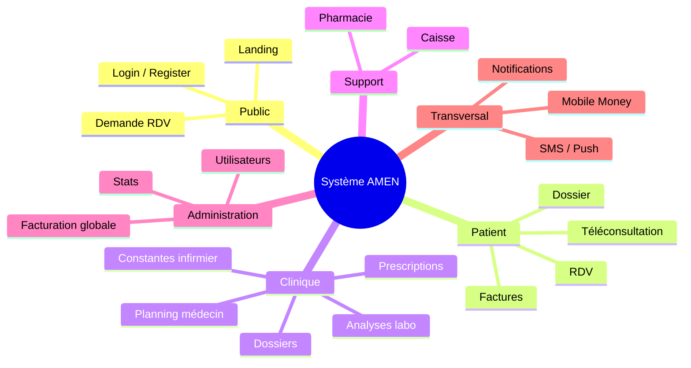
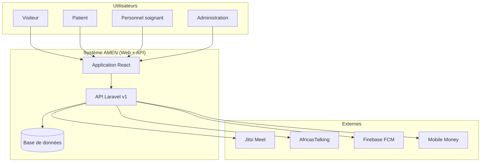
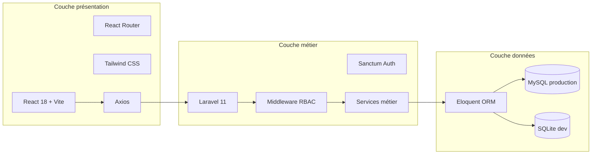
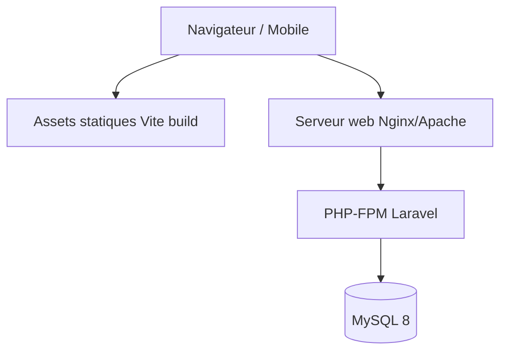
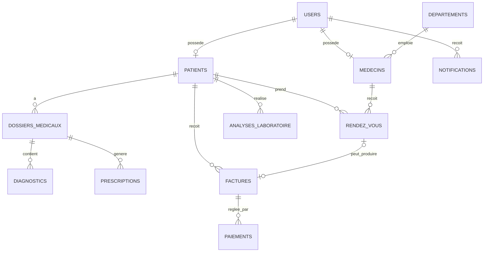
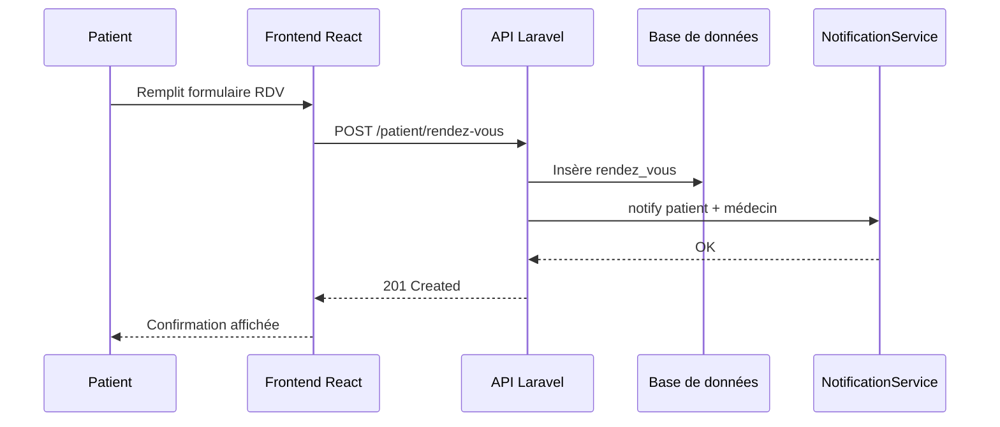
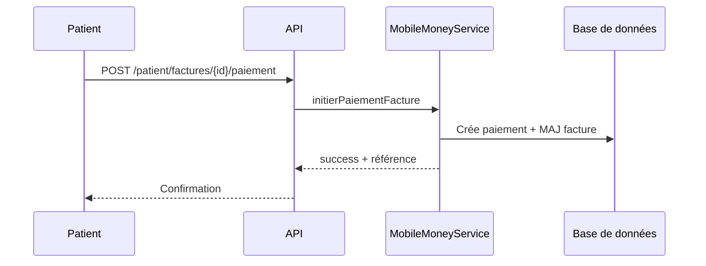
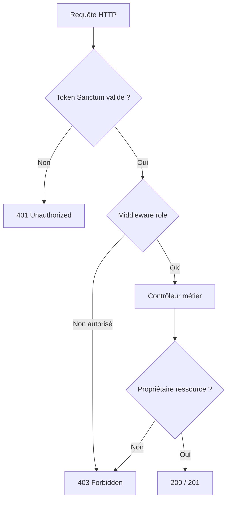

# CHAPITRE III — ANALYSE ET CONCEPTION DU SYSTÈME PROPOSÉ

## Centre Médical AMEN — FOSPHA ONGD/ASBL, Kinshasa (RDC)

**Travail de fin de cycle (L3 LMD)**  
**Thème :** Conception et implémentation d'une application hybride de digitalisation hospitalière  
**Dépôt du code source :** [https://github.com/Exauce09/TFC-ENGWELE](https://github.com/Exauce09/TFC-ENGWELE)

---

## Introduction du chapitre

Le présent chapitre approfondit l'analyse du système d'information hospitalier proposé pour le Centre Médical AMEN. Il complète le chapitre I en détaillant, selon une démarche structurée, les besoins des utilisateurs, les fonctionnalités attendues, la modélisation (diagrammes, architecture, base de données) et les choix techniques retenus.

L'objectif est de démontrer que la solution envisagée répond de manière cohérente aux contraintes du terrain kinshasa et aux exigences d'un établissement de santé polyvalent, tout en restant évolutive vers une application mobile et vers des modules spécialisés (maternité, chirurgie, accueil, etc.).

---

## a. Besoins des utilisateurs

### a.1 Méthodologie de recueil

Les besoins ont été identifiés par :

- **Observation** des flux réels d'un centre médical (accueil, consultation, laboratoire, pharmacie, caisse) ;
- **Entretiens informels** avec les catégories de personnel (médecins, infirmiers, caissiers, administration) ;
- **Analyse comparative** de systèmes d'information de santé (SIH) et de bonnes pratiques (RBAC, traçabilité, API REST) ;
- **Prise en compte du contexte local** : usage du Mobile Money (Airtel, M-Pesa), SMS, connectivité variable, langue française.

### a.2 Besoins par catégorie d'utilisateurs

#### Patient

| Besoin | Description | Priorité |
|--------|-------------|----------|
| S'inscrire et se connecter | Création de compte en ligne, accès sécurisé à son espace | Haute |
| Prendre rendez-vous | Choisir département, médecin, date, type (présentiel / téléconsultation) | Haute |
| Consulter son dossier | Voir consultations, diagnostics, prescriptions | Haute |
| Payer en ligne | Factures et téléconsultation via Mobile Money | Haute |
| Recevoir des notifications | Confirmations RDV, rappels, résultats, paiements | Moyenne |
| Téléconsultation | Rejoindre une consultation vidéo depuis le navigateur | Moyenne |

#### Médecin

| Besoin | Description | Priorité |
|--------|-------------|----------|
| Voir son planning | Liste des RDV du jour et à venir | Haute |
| Gérer les dossiers | Créer et mettre à jour consultations, diagnostics | Haute |
| Prescrire | Émettre des ordonnances liées au dossier | Haute |
| Changer le statut des RDV | Confirmer, annuler, marquer terminé | Haute |
| Téléconsultation | Démarrer une salle vidéo avec le patient | Moyenne |
| Liste des patients | Rechercher un patient par nom ou numéro | Moyenne |

#### Infirmier(ère)

| Besoin | Description | Priorité |
|--------|-------------|----------|
| Saisir les constantes vitales | Tension, température, pouls, poids, etc. | Haute |
| Consulter la liste des patients | Identifier le patient avant la saisie | Moyenne |

#### Laborantin

| Besoin | Description | Priorité |
|--------|-------------|----------|
| Enregistrer des analyses | Créer une demande pour un patient | Haute |
| Publier les résultats | Saisir et valider les résultats structurés | Haute |
| Tableau de bord | Suivre analyses en attente / disponibles | Moyenne |

#### Pharmacien

| Besoin | Description | Priorité |
|--------|-------------|----------|
| Gérer le stock | Quantités, seuils d'alerte, prix | Haute |
| Délivrer les ordonnances | Marquer une prescription comme délivrée | Haute |

#### Caissier

| Besoin | Description | Priorité |
|--------|-------------|----------|
| Émettre des factures | Lignes détaillées, remises, lien patient | Haute |
| Enregistrer les paiements | Espèces, Mobile Money, virement | Haute |
| Suivre les impayés | Montants restants, historique | Haute |

#### Administrateur

| Besoin | Description | Priorité |
|--------|-------------|----------|
| Superviser l'activité | Statistiques patients, RDV, facturation | Haute |
| Gérer les utilisateurs | Création, activation/désactivation des comptes | Haute |
| Gérer patients, médecins, départements | Référentiels de l'établissement | Haute |
| Traiter les demandes RDV publiques | Demandes issues du site sans compte | Haute |

#### Visiteur (non connecté)

| Besoin | Description | Priorité |
|--------|-------------|----------|
| Découvrir le centre | Services, médecins, contact | Haute |
| Demander un rendez-vous | Formulaire simple sans inscription | Haute |

### a.3 Besoins non fonctionnels

| Catégorie | Exigence |
|-----------|----------|
| **Sécurité** | Authentification par token, contrôle d'accès par rôle (RBAC), données de santé isolées par patient |
| **Performance** | Pagination des listes, requêtes ciblées, interface légère (SPA React) |
| **Disponibilité** | Architecture découplée frontend / backend pour maintenance indépendante |
| **Traçabilité** | Horodatage, statuts explicites (RDV, factures, paiements) |
| **Évolutivité** | API versionnée (`/api/v1`), modules ajoutables sans refonte |
| **Interopérabilité** | Connecteurs Jitsi, AfricasTalking, FCM, opérateurs Mobile Money |
| **Utilisabilité** | Interface en français, espaces métier distincts, responsive (Tailwind) |

### a.4 Contraintes du contexte kinshasa

- Paiements majoritairement **mobiles** (Airtel Money, M-Pesa) plutôt que carte bancaire ;
- **SMS** souvent plus fiable que l'e-mail pour alerter les patients ;
- **Connexion internet** parfois instable : limiter les allers-retours, prévoir mode démo / mock pour les intégrations en développement ;
- **Adoption progressive** : déploiement par modules (RDV → dossier → facturation → intégrations).

---

## b. Fonctionnalités attendues

### b.1 Cartographie fonctionnelle globale



### b.2 Matrice des fonctionnalités par module

| Module | Fonctionnalités implémentées (web) | Extensions prévues |
|--------|-----------------------------------|-------------------|
| **Authentification** | Inscription patient, login, logout, profil API, rôles | Mot de passe oublié (UI), page profil |
| **Rendez-vous** | CRUD patient, planning médecin, demande publique, statuts admin | Rappels automatiques 24h/1h |
| **Dossier médical** | Consultations, diagnostics, prescriptions | Imagerie, pièces jointes |
| **Laboratoire** | CRUD analyses, publication résultats | Notification auto patient |
| **Pharmacie** | Stock, délivrance ordonnances | Alertes stock par SMS |
| **Facturation** | Factures, paiements caisse, paiement patient Mobile Money | Export PDF |
| **Téléconsultation** | Salles Jitsi, paiement préalable | Enregistrement séance |
| **Notifications** | In-app, option SMS/push | Page historique complète |
| **Admin** | Stats, listes, RDV, utilisateurs, facturation | CRUD complet, graphiques réels |
| **Spécialités** | — | Maternité, chirurgie, écho, kiné, dentisterie, accueil |

### b.3 Règles métier principales

1. Un patient ne voit que **ses** données (RDV, dossier, factures).
2. Un médecin modifie les dossiers et RDV qui lui sont **attribués**.
3. Une facture **annulée** n'accepte plus de paiement.
4. Le montant payé ne peut **excéder** le reste à payer.
5. La téléconsultation peut exiger un **paiement confirmé** avant accès à la salle vidéo.
6. Seul l'**administrateur** crée les comptes du personnel.

### b.4 Cas d'utilisation prioritaires

| ID | Cas d'utilisation | Acteur | Résultat attendu |
|----|-------------------|--------|------------------|
| UC-01 | Prendre un rendez-vous | Patient | RDV enregistré, notifications envoyées |
| UC-02 | Consulter le dossier | Patient | Historique consultations et prescriptions |
| UC-03 | Rédiger une consultation | Médecin | Dossier enrichi, diagnostic et prescription possibles |
| UC-04 | Publier un résultat d'analyse | Laborantin | Statut « résultat disponible », notification patient |
| UC-05 | Émettre une facture | Caissier | Facture numérotée, notification patient |
| UC-06 | Payer une facture | Patient | Paiement Mobile Money, statut facture mis à jour |
| UC-07 | Rejoindre une téléconsultation | Patient / Médecin | Session Jitsi ouverte |
| UC-08 | Superviser l'activité | Admin | Tableaux de bord et listes à jour |

---

## c. Modélisation (diagrammes, architecture, base de données)

### c.1 Diagramme de contexte



### c.2 Architecture logique en trois couches



**Principe API first :** le frontend web et l'application mobile future consomment la même API REST, évitant la duplication de la logique métier.

### c.3 Diagramme de déploiement (cible)



En **développement**, le frontend tourne sur `127.0.0.1:5173` (Vite) et l'API sur `127.0.0.1:8000` (artisan serve), avec SQLite.

### c.4 Modèle de données — entités principales



### c.5 Tables relationnelles (extrait)

| Table | Rôle | Clés / remarques |
|-------|------|------------------|
| `users` | Comptes applicatifs | `role`, `email`, `fcm_token` |
| `patients` | Données administratives patient | FK `user_id` |
| `medecins` | Données professionnelles | FK `user_id`, `departement_id` |
| `departements` | Structure hospitalière | `code`, `nom` |
| `rendez_vous` | Planification | `type`, `statut`, `lien_video`, `paiement_statut` |
| `dossiers_medicaux` | Consultations | FK `patient_id`, `medecin_id` |
| `diagnostics` | Conclusions | FK `dossier_id` |
| `prescriptions` | Ordonnances (JSON médicaments) | FK `dossier_id` |
| `analyses_laboratoire` | Examens | `resultats` JSON |
| `stock_medicaments` | Pharmacie | `seuil_alerte` |
| `factures` | Facturation | `lignes` JSON, `statut` |
| `paiements` | Encaissements | `mode_paiement` |
| `notifications` | Messages utilisateur | `type`, `lu`, `data` JSON |

**Tables prévues (extensions) :** `resultats_echographie`, `seances_kinesitherapie`, `operations_chirurgicales`, `suivis_maternite`, `soins_dentaires`.

### c.6 Diagramme de séquence — Prise de rendez-vous



### c.7 Diagramme de séquence — Paiement facture



### c.8 Modèle de sécurité (accès)



---

## d. Choix techniques

### d.1 Stack retenue

| Composant | Technologie | Justification |
|-----------|-------------|---------------|
| **Backend** | Laravel 11 (PHP 8.3) | Maturité, écosystème, ORM, migrations, Sanctum |
| **API** | REST JSON `/api/v1` | Standard, compatible web et mobile |
| **Authentification** | Laravel Sanctum (Bearer token) | Simple, adapté SPA + future app mobile |
| **Base de données** | MySQL 8 (prod) / SQLite (dev) | Relationnel, intégrité référentielle |
| **Frontend** | React 18 + Vite | Composants réutilisables, HMR, performance |
| **Styles** | Tailwind CSS | Développement rapide, responsive |
| **HTTP client** | Axios | Intercepteurs token, gestion erreurs |
| **Routing** | React Router v6 | Routes privées par rôle |
| **Vidéo** | Jitsi Meet (meet.jit.si) | Open source, sans installation lourde |
| **SMS** | AfricasTalking | Présent en Afrique, API documentée |
| **Push** | Firebase Cloud Messaging | Standard mobile, token par utilisateur |
| **Paiement** | Airtel Money / M-Pesa | Opérateurs dominants en RDC |

### d.2 Choix d'architecture

| Choix | Alternative écartée | Motif |
|-------|---------------------|-------|
| **API first** | Logique métier dans le frontend | Réutilisation mobile, sécurité centralisée |
| **Monolithe Laravel modulaire** | Microservices | Complexité excessive pour la taille du centre |
| **RBAC par rôle unique** | Permissions granulaires | Simplicité, 18 rôles métier suffisants en phase 1 |
| **JSON pour lignes facture / médicaments** | Tables de détail normalisées | Flexibilité, moins de jointures en MVP |
| **Services d'intégration encapsulés** | Appels directs dans contrôleurs | Mock mode, remplacement fournisseur facilité |

### d.3 Organisation du code

```
hopital-amen/
├── backend-runtime/     # API Laravel (exécution)
│   ├── app/Http/Controllers/Api/
│   ├── app/Services/    # FCM, SMS, Jitsi, Mobile Money
│   ├── app/Models/
│   └── routes/api.php
├── frontend/            # React
│   └── src/pages/       # Par rôle métier
└── docs/                # Documentation TFC + roadmap
```

### d.4 Conventions API

**Format de réponse uniforme :**

```json
{
  "success": true,
  "message": "Description lisible",
  "data": {},
  "meta": {}
}
```

**Versionnement :** préfixe `/api/v1` pour permettre une future `v2` sans rupture.

**Sécurité :**

- Mots de passe hachés (bcrypt) ;
- `throttle` sur login et inscription ;
- CORS configuré pour l'origine frontend (`127.0.0.1:5173`) ;
- Validation Laravel sur toutes les entrées.

### d.5 Environnement et outils

| Variable / outil | Usage |
|----------------|-------|
| `VITE_API_URL` | URL de l'API côté frontend |
| `.env` Laravel | DB, clés FCM, AfricasTalking, Mobile Money |
| `MOBILE_MONEY_MOCK=true` | Simulation paiements en développement |
| Git + GitHub | Versionnement continu ([TFC-ENGWELE](https://github.com/Exauce09/TFC-ENGWELE)) |
| Composer / npm | Gestion des dépendances PHP et JS |

### d.6 Stratégie de déploiement

| Environnement | Base | Usage |
|---------------|------|-------|
| Développement | SQLite | Travail local, démonstrations |
| Test / recette | MySQL | Validation par le personnel AMEN |
| Production | MySQL + HTTPS | Exploitation réelle au centre |

**Build frontend :** `npm run build` → fichiers statiques servis par Nginx ou hébergement statique, communiquant avec l'API en HTTPS.

---

## Conclusion du chapitre

Ce chapitre a présenté une analyse structurée du système proposé : les besoins des utilisateurs ont été classés par acteur et priorisés ; les fonctionnalités attendues ont été cartographiées et associées à des règles métier ; la modélisation (contexte, architecture, données, séquences, sécurité) fournit une base pour l'implémentation ; les choix techniques (Laravel, React, Sanctum, MySQL, intégrations locales) répondent aux contraintes du Centre Médical AMEN à Kinshasa.

La suite du travail consiste à **implémenter** et **valider** ces choix (chapitre implémentation), en suivant la feuille de route documentée dans `docs/ROADMAP_WEB.md`, avec un versionnement systématique sur GitHub.

---

## Bibliographie

1. Laravel Documentation — [https://laravel.com/docs](https://laravel.com/docs)
2. React Documentation — [https://react.dev](https://react.dev)
3. OMS — Cadre pour les systèmes d'information sanitaire
4. IEEE 830 — Spécifications des exigences logicielles
5. Documentation AfricasTalking, Jitsi, Firebase FCM

---

*Document rédigé dans le cadre du Travail de Fin de Cycle — Licence 3 LMD en Informatique de Gestion.*  
*Centre Médical AMEN — FOSPHA ONGD/ASBL — Kinshasa, République Démocratique du Congo.*
