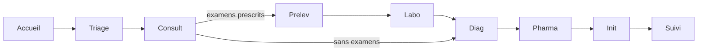
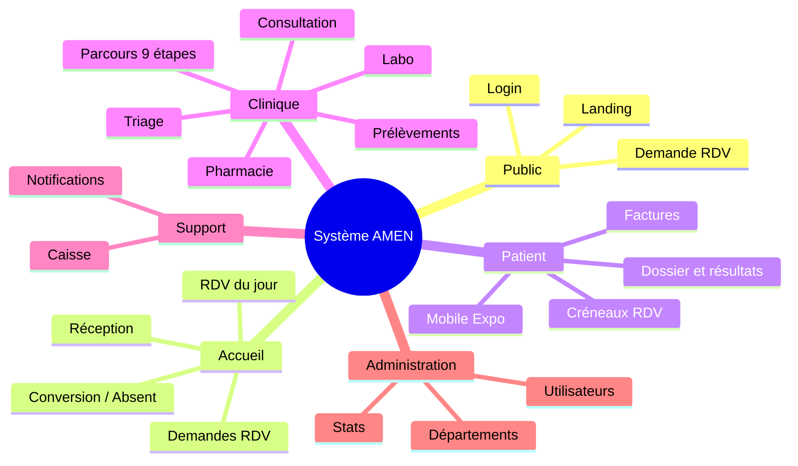
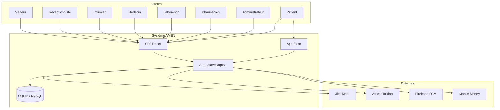
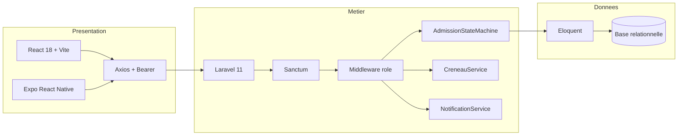
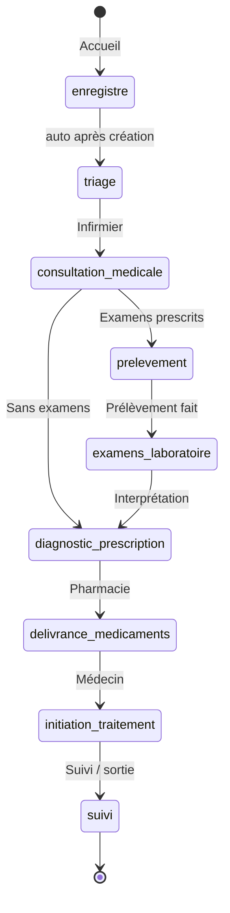
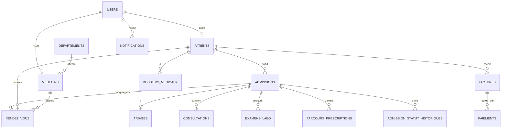
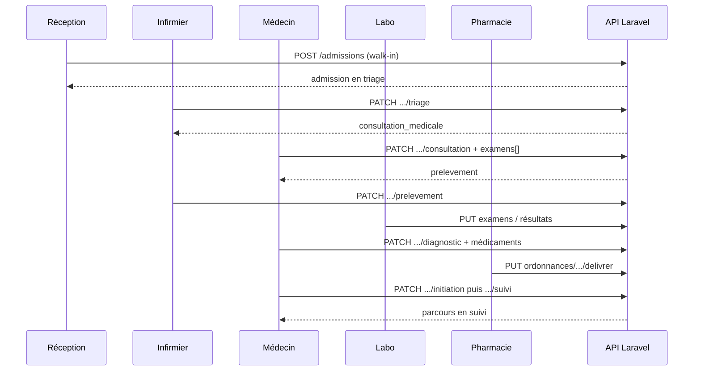
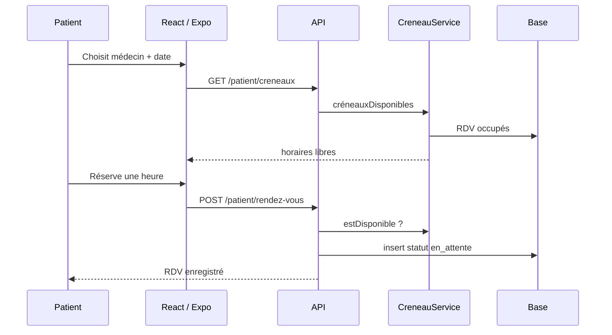
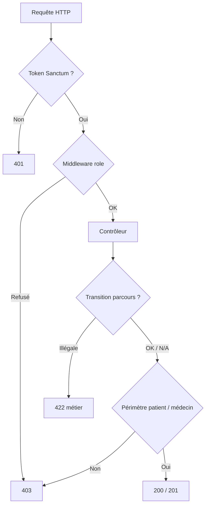

# CHAPITRE III — ANALYSE ET CONCEPTION DU SYSTÈME PROPOSÉ

## Centre Médical AMEN — FOSPHA ONGD/ASBL, Kinshasa (RDC)

**Travail de fin de cycle (L3 LMD)**  
**Thème :** Conception et implémentation d'une application hybride de digitalisation hospitalière  
**Dépôt du code source :** [https://github.com/Exauce09/TFC-ENGWELE](https://github.com/Exauce09/TFC-ENGWELE)

---

## Introduction du chapitre

Après avoir situé le problème et le cadre théorique, le présent chapitre décrit de manière structurée le **système d'information hospitalier** conçu et développé pour le Centre Médical AMEN. Il s'articule autour de quatre axes :

- **a.** les besoins des utilisateurs ;
- **b.** les fonctionnalités attendues ;
- **c.** la modélisation (diagrammes, architecture, base de données) ;
- **d.** les choix techniques.

La démarche s'appuie sur l'observation des flux réels d'un centre médical polyvalent à Kinshasa et sur l'implémentation concrète d'une plateforme **hybride** (web React + API Laravel + application mobile Expo), centrée sur un **parcours patient en neuf étapes** : de l'accueil à l'initiation du traitement et au suivi.

---

## a. Besoins des utilisateurs

### a.1 Méthodologie de recueil

Les besoins ont été identifiés par :

1. **Observation** des circuits physiques : réception → triage → consultation → laboratoire / pharmacie → sortie ;
2. **Entretiens** avec les catégories d'acteurs (réceptionnistes, infirmiers, médecins, laborantins, pharmaciens, caissiers, patients) ;
3. **Analyse comparative** des bonnes pratiques SIH (contrôle d'accès par rôle, traçabilité, API REST, dossier unique) ;
4. **Prise en compte du contexte local** : français comme langue d'interface, Mobile Money (Airtel Money, M-Pesa), SMS, connectivité variable, adoption progressive du numérique.

### a.2 Besoins par catégorie d'utilisateurs

#### Réceptionniste (accueil)

| Besoin | Description | Priorité |
|--------|-------------|----------|
| Enregistrer le patient | Créer l'identité, le dossier et les identifiants d'espace patient (1ʳᵉ connexion) | Haute |
| Accueillir walk-in ou RDV | Ouvrir une admission, convertir un rendez-vous du jour en accueil | Haute |
| Confirmer les demandes RDV | Valider créneau médecin / date / heure, refuser si besoin | Haute |
| Orienter vers le triage | Faire passer l'admission au statut triage | Haute |

*Règle métier retenue :* seul l'accueil crée le patient ; le médecin complète le parcours, il ne crée pas le dossier d'identité.

#### Patient

| Besoin | Description | Priorité |
|--------|-------------|----------|
| Se connecter (1ʳᵉ fois) | Login + mot de passe par défaut, compléter le profil | Haute |
| Choisir un créneau | Réserver un horaire libre chez un médecin (web et mobile) | Haute |
| Suivre ses RDV | Statuts `en_attente` / `confirmé`, annuler ou reporter (créneau libéré) | Haute |
| Recevoir des rappels | Notifications J-1 et H-2 avant le rendez-vous | Haute |
| Consulter son dossier | Consultations, **résultats d'examens**, prescriptions | Haute |
| Payer | Factures et téléconsultation (Mobile Money, mode démo inclus) | Moyenne |
| Téléconsultation | Accès salle vidéo après confirmation / paiement | Moyenne |

#### Infirmier(ère)

| Besoin | Description | Priorité |
|--------|-------------|----------|
| Triage | Constantes vitales, niveau d'urgence, orientation vers le médecin | Haute |
| Prélèvement | File dédiée après prescription d'examens, transmission au labo | Haute |
| Constantes / patients | Saisie complémentaire et recherche patient | Moyenne |

#### Médecin

| Besoin | Description | Priorité |
|--------|-------------|----------|
| File de consultation | Patients **après triage**, prêts pour consultation | Haute |
| Conduire la consultation | Anamnèse, examen, hypothèses ; option examens labo | Haute |
| Interpréter et prescrire | Diagnostic final + ordonnance parcours | Haute |
| Initier le traitement | Après délivrance pharmacie, consignes et suivi | Haute |
| Planning RDV | Voir et mettre à jour les rendez-vous du jour | Moyenne |

#### Laborantin

| Besoin | Description | Priorité |
|--------|-------------|----------|
| File d'examens | Voir les analyses prescrites liées aux admissions | Haute |
| Saisir les résultats | Paramètres structurés, interprétation, notification médecin | Haute |

#### Pharmacien

| Besoin | Description | Priorité |
|--------|-------------|----------|
| File d'ordonnances | Ordonnances du **parcours** en attente de délivrance | Haute |
| Délivrer | Lier lots / stock, faire avancer l'admission vers l'initiation | Haute |
| Gérer le stock | Quantités, seuils, lots | Moyenne |

#### Caissier / Administrateur

| Besoin | Description | Priorité |
|--------|-------------|----------|
| Facturer et encaisser | Factures, paiements cash ou Mobile Money | Haute |
| Superviser | Stats, utilisateurs, départements, demandes | Haute |

#### Visiteur (non authentifié)

| Besoin | Description | Priorité |
|--------|-------------|----------|
| Découvrir le centre | Landing, services, contact | Haute |
| Demander un RDV | Formulaire public sans compte | Haute |

### a.3 Besoins non fonctionnels

| Catégorie | Exigence |
|-----------|----------|
| **Sécurité** | Authentification par jeton (Sanctum), RBAC strict par rôle, isolement des données patient |
| **Traçabilité** | Historique des statuts d'admission, horodatage, acteur (user + rôle) |
| **Cohérence métier** | Machine à états : transitions illégales refusées (ex. accueil → pharmacie) |
| **Performance** | Pagination, SPA légère, API découplée |
| **Disponibilité** | Frontend et backend indépendants ; mode mock pour SMS / Mobile Money en développement |
| **Évolutivité** | API versionnée `/api/v1`, modules (maternité, chirurgie…) branchables |
| **Utilisabilité** | Interfaces par métier, français, responsive ; mobile Expo pour le patient |
| **Interopérabilité** | Jitsi, AfricasTalking, FCM, Airtel Money / M-Pesa |

### a.4 Contraintes du contexte kinshasa

- Paiements **mobiles** privilégiés (Airtel Money, M-Pesa) ;
- **SMS** souvent plus fiable que l'e-mail pour les rappels RDV ;
- Connexion parfois instable → architecture API légère, mocks en démo ;
- Déploiement **progressif** : d'abord le parcours clinique ambulatoire, puis les modules spécialisés.

---

## b. Fonctionnalités attendues

### b.1 Vision fonctionnelle : le parcours patient en 9 étapes

Le cœur du système est le **parcours d'admission**, qui formalise la prise en charge ambulatoire du patient :


```mermaid
flowchart LR
  Accueil --> Triage
  Triage --> Consult
  Consult -->|examens prescrits| Prelev
  Prelev --> Labo
  Labo --> Diag
  Consult -->|sans examens| Diag
  Diag --> Pharma
  Pharma --> Init
  Init --> Suivi
```

| Étape | Statut technique | Acteur principal | Action clé |
|-------|------------------|------------------|------------|
| 1. Accueil | `enregistre` → `triage` | Réceptionniste | Identification, motif, ouverture admission |
| 2. Triage | `triage` → `consultation_medicale` | Infirmier | Constantes + urgence |
| 3. Consultation | `consultation_medicale` → `prelevement` **ou** `diagnostic_prescription` | Médecin | Anamnèse ; création des examens si prescrits |
| 4. Prélèvement | `prelevement` → `examens_laboratoire` | Infirmier | Échantillon, n° d'échantillon |
| 5. Laboratoire | `examens_laboratoire` | Laborantin | Résultats structurés |
| 6. Diagnostic & Rx | → `diagnostic_prescription` | Médecin | Diagnostic + `ParcoursPrescription` |
| 7. Pharmacie | → `delivrance_medicaments` | Pharmacien | Délivrance (stock / lots) |
| 8. Initiation | → `initiation_traitement` | Médecin | Consignes thérapeutiques |
| 9. Suivi | → `suivi` | Médecin / Accueil | Notes, RDV de contrôle, clôture facturation |

### b.2 Cycle de vie des rendez-vous

En parallèle du parcours walk-in, le système gère les **rendez-vous** :

1. Le patient **choisit un créneau** disponible (créneaux de 30 min selon disponibilités du médecin) ;
2. RDV créé en `en_attente` ;
3. La réception **confirme** (avec sélecteur de créneaux) → `confirmé` ;
4. **Rappels automatiques** J-1 puis H-2 (commande planifiée) ;
5. Annulation / report → **créneau libéré** ;
6. Jour J : réception **convertit** le RDV en admission (`rdv_id`) → patient reçu (`termine`) ou **absent**.

### b.3 Cartographie des modules


```mermaid
mindmap
  root((Système AMEN))
    Public
      Landing
      Demande RDV
      Login
    Accueil
      Réception
      Demandes RDV
      RDV du jour
      Conversion / Absent
    Patient
      Créneaux RDV
      Dossier et résultats
      Factures
      Mobile Expo
    Clinique
      Parcours 9 étapes
      Triage
      Prélèvements
      Consultation
      Labo
      Pharmacie
    Support
      Caisse
      Notifications
    Administration
      Stats
      Utilisateurs
      Départements
```

### b.4 Matrice des fonctionnalités (état actuel)

| Module | Fonctionnalités réalisées | Extensions prévues |
|--------|---------------------------|-------------------|
| **Accueil** | Formulaire complet, conversion RDV, confirmation avec créneaux | File visuelle priorité walk-in |
| **Parcours** | Machine à états, dossier unique `/parcours/:id`, facturation d'actes | Hospitalisation lit/chambre |
| **RDV patient** | Créneaux, report, annulation, rappels J-1/H-2 | Push FCM réel hors mock |
| **Médecin** | File post-triage, consultation + examens, diagnostic, initiation | Certificats PDF |
| **Infirmier** | Triage, page prélèvements, constantes | Notes d'évolution hospitalisées |
| **Labo** | File examens parcours, résultats structurés | Imagerie radio/scanner |
| **Pharmacie** | Ordonnances parcours, délivrance, stock | Traçabilité avancée lots |
| **Patient** | Dossier, résultats, prescriptions parcours, RDV web/mobile | Support / messagerie |
| **Caisse / Admin** | Factures, paiements, stats, utilisateurs | Exports PDF / reporting BI |
| **Téléconsultation** | Jitsi + paiement préalable | Enregistrement séance |

### b.5 Règles métier principales

1. **Seul l'accueil** crée le patient et ouvre le dossier d'identité.
2. Les transitions d'admission sont **contrôlées** (`AdmissionStateMachine`) : aucun saut illégal.
3. Prescrire des examens **exige** au moins une ligne `ExamenLabo` (évite une file labo vide).
4. Les ordonnances d'une admission active passent par `ParcoursPrescription` (la pharmacie fait avancer le statut).
5. Un patient ne voit que **ses** RDV, résultats et factures.
6. Annuler / reporter un RDV **libère** le créneau pour d'autres patients.
7. Une facture annulée n'accepte plus de paiement ; le payé ne dépasse pas le reste dû.

### b.6 Cas d'utilisation prioritaires

| ID | Cas d'utilisation | Acteur | Résultat |
|----|-------------------|--------|----------|
| UC-01 | Enregistrer un patient walk-in | Réceptionniste | Admission en triage + identifiants patient |
| UC-02 | Réaliser le triage | Infirmier | Passage en consultation médicale |
| UC-03 | Consulter et prescrire des examens | Médecin | Création examens + statut prélèvement |
| UC-04 | Effectuer le prélèvement | Infirmier | Transmission au laboratoire |
| UC-05 | Publier les résultats | Laborantin | Résultats visibles médecin / patient |
| UC-06 | Diagnostiquer et prescrire | Médecin | Ordonnance parcours active |
| UC-07 | Délivrer les médicaments | Pharmacien | Statut délivrance → initiation |
| UC-08 | Initier le traitement puis suivi | Médecin | Parcours clos en `suivi` |
| UC-09 | Prendre / confirmer un RDV | Patient / Accueil | Créneau réservé, rappels planifiés |
| UC-10 | Convertir RDV du jour | Réceptionniste | Admission liée au RDV (patient reçu) |

---

## c. Modélisation (diagrammes, architecture, base de données)

### c.1 Diagramme de contexte


```mermaid
flowchart TB
  subgraph Acteurs
    Rec[Réceptionniste]
    Inf[Infirmier]
    Med[Médecin]
    Lab[Laborantin]
    Pha[Pharmacien]
    Pat[Patient]
    Adm[Administrateur]
    Vis[Visiteur]
  end
  subgraph Systeme["Système AMEN"]
    WEB[SPA React]
    MOB[App Expo]
    API[API Laravel /api/v1]
    DB[(SQLite / MySQL)]
  end
  subgraph Externes
    JIT[Jitsi Meet]
    SMS[AfricasTalking]
    FCM[Firebase FCM]
    MM[Mobile Money]
  end
  Vis --> WEB
  Rec --> WEB
  Inf --> WEB
  Med --> WEB
  Lab --> WEB
  Pha --> WEB
  Adm --> WEB
  Pat --> WEB
  Pat --> MOB
  WEB --> API
  MOB --> API
  API --> DB
  API --> JIT
  API --> SMS
  API --> FCM
  API --> MM
```

### c.2 Architecture logique (API first)


```mermaid
flowchart LR
  subgraph Presentation
    R[React 18 + Vite]
    E[Expo React Native]
    AX[Axios + Bearer]
  end
  subgraph Metier
    L[Laravel 11]
    S[Sanctum]
    RBAC[Middleware role]
    SM[AdmissionStateMachine]
    CR[CreneauService]
    NS[NotificationService]
  end
  subgraph Donnees
    ORM[Eloquent]
    DB[(Base relationnelle)]
  end
  R --> AX
  E --> AX
  AX --> L
  L --> S --> RBAC --> SM
  RBAC --> CR
  RBAC --> NS
  SM --> ORM --> DB
```

**Principe :** une seule API REST alimente le web et le mobile ; la logique métier (parcours, créneaux, notifications) reste côté serveur.

### c.3 Architecture de déploiement

| Environnement | Frontend | API | Base |
|---------------|----------|-----|------|
| Développement | Vite `127.0.0.1:5173` | `artisan serve :8000` | SQLite |
| Démonstration | Build GitHub Pages | API locale / hébergée | SQLite ou MySQL |
| Production | Assets Nginx | PHP-FPM + Laravel | MySQL 8 |

### c.4 Machine à états du parcours (modèle dynamique)


```mermaid
stateDiagram-v2
  [*] --> enregistre : Accueil
  enregistre --> triage : auto après création
  triage --> consultation_medicale : Infirmier
  consultation_medicale --> prelevement : Examens prescrits
  consultation_medicale --> diagnostic_prescription : Sans examens
  prelevement --> examens_laboratoire : Prélèvement fait
  examens_laboratoire --> diagnostic_prescription : Interprétation
  diagnostic_prescription --> delivrance_medicaments : Pharmacie
  delivrance_medicaments --> initiation_traitement : Médecin
  initiation_traitement --> suivi : Suivi / sortie
  suivi --> [*]
```

Cette machine est implémentée dans `AdmissionStateMachine` : toute transition non autorisée renvoie une erreur métier (HTTP 422).

### c.5 Modèle de données — entités centrales


```mermaid
erDiagram
  USERS ||--o| PATIENTS : profil
  USERS ||--o| MEDECINS : profil
  DEPARTEMENTS ||--o{ MEDECINS : affecte
  PATIENTS ||--o{ ADMISSIONS : subit
  ADMISSIONS ||--o| RENDEZ_VOUS : origine_rdv
  ADMISSIONS ||--o| TRIAGES : a
  ADMISSIONS ||--o{ CONSULTATIONS : contient
  ADMISSIONS ||--o{ EXAMENS_LABO : prescrit
  ADMISSIONS ||--o{ PARCOURS_PRESCRIPTIONS : genere
  ADMISSIONS ||--o{ ADMISSION_STATUT_HISTORIQUES : trace
  PATIENTS ||--o{ RENDEZ_VOUS : reserve
  MEDECINS ||--o{ RENDEZ_VOUS : assure
  PATIENTS ||--o{ DOSSIERS_MEDICAUX : a
  PATIENTS ||--o{ FACTURES : recoit
  FACTURES ||--o{ PAIEMENTS : reglee_par
  USERS ||--o{ NOTIFICATIONS : recoit
```

### c.6 Tables principales (extrait)

| Table | Rôle | Points clés |
|-------|------|-------------|
| `users` | Comptes | `role`, `login_identifiant`, `fcm_token` |
| `patients` | Identité administrative | FK `user_id`, allergies, assurance, photo |
| `medecins` | Profil médical | `disponibilites` JSON, `departement_id` |
| `admissions` | **Parcours 9 étapes** | `statut`, `rdv_id`, `mode_arrivee`, motif |
| `triages` | Constantes d'entrée | niveau d'urgence, TA, T°, SpO₂… |
| `consultations` | Actes médicaux parcours | anamnèse, diagnostics provisoire / final |
| `examens_labo` | Analyses liées à l'admission | priorité, résultats JSON, échantillon |
| `parcours_prescriptions` | Ordonnances du parcours | médicaments JSON, lots délivrance |
| `admission_statut_historiques` | Audit | statut avant/après, user, rôle |
| `rendez_vous` | Planification | créneau, rappels J-1/H-2, `lien_video` |
| `dossiers_medicaux` | Dossier consultation | ouvert à l'accueil, complété médecin |
| `factures` / `paiements` | Finances | lignes, Mobile Money |
| `notifications` | Alertes | types RDV, résultats, système |
| `stock_medicaments` | Pharmacie | seuils, lots |

### c.7 Diagramme de séquence — Walk-in jusqu'au traitement (synthèse)


```mermaid
sequenceDiagram
  participant R as Réception
  participant I as Infirmier
  participant M as Médecin
  participant L as Labo
  participant P as Pharmacie
  participant API as API Laravel

  R->>API: POST /admissions (walk-in)
  API-->>R: admission en triage
  I->>API: PATCH .../triage
  API-->>I: consultation_medicale
  M->>API: PATCH .../consultation + examens[]
  API-->>M: prelevement
  I->>API: PATCH .../prelevement
  L->>API: PUT examens / résultats
  M->>API: PATCH .../diagnostic + médicaments
  P->>API: PUT ordonnances/.../delivrer
  M->>API: PATCH .../initiation puis .../suivi
  API-->>M: parcours en suivi
```

### c.8 Diagramme de séquence — Prise de créneau patient


```mermaid
sequenceDiagram
  participant Pat as Patient
  participant WEB as React / Expo
  participant API as API
  participant CR as CreneauService
  participant DB as Base

  Pat->>WEB: Choisit médecin + date
  WEB->>API: GET /patient/creneaux
  API->>CR: créneauxDisponibles
  CR->>DB: RDV occupés
  CR-->>WEB: horaires libres
  Pat->>WEB: Réserve une heure
  WEB->>API: POST /patient/rendez-vous
  API->>CR: estDisponible ?
  API->>DB: insert statut en_attente
  API-->>Pat: RDV enregistré
```

### c.9 Modèle de sécurité


```mermaid
flowchart TD
  REQ[Requête HTTP] --> AUTH{Token Sanctum ?}
  AUTH -->|Non| E401[401]
  AUTH -->|Oui| ROLE{Middleware role}
  ROLE -->|Refusé| E403[403]
  ROLE -->|OK| CTRL[Contrôleur]
  CTRL --> SM{Transition parcours ?}
  SM -->|Illégale| E422[422 métier]
  SM -->|OK / N/A| OWN{Périmètre patient / médecin}
  OWN -->|Non| E403
  OWN -->|Oui| OK[200 / 201]
```

---

## d. Choix techniques

### d.1 Stack retenue

| Composant | Technologie | Justification |
|-----------|-------------|---------------|
| Backend | **Laravel 11** (PHP 8.3) | Migrations, Eloquent, validation, écosystème mature |
| API | REST JSON **`/api/v1`** | Standard, consommable web + mobile |
| Auth | **Laravel Sanctum** (Bearer) | SPA et mobile sans OAuth lourd |
| Base | **MySQL 8** (prod) / **SQLite** (dev) | Intégrité référentielle, simplicité locale |
| Frontend web | **React 18 + Vite + Tailwind** | SPA par rôles, prototypage rapide, responsive |
| Mobile | **React Native Expo** | Partage de l'API, déploiement Expo Go / APK |
| HTTP | **Axios** | Intercepteurs token, gestion d'erreurs |
| Vidéo | **Jitsi Meet** | Téléconsultation sans infrastructure lourde |
| SMS / Push | AfricasTalking, FCM | Adaptés au contexte africain / mobile |
| Paiement | Airtel Money / M-Pesa (+ mock) | Réalité monétaire kinshasa |

### d.2 Choix d'architecture et de conception

| Choix | Alternative écartée | Motif |
|-------|---------------------|-------|
| **API first** | Logique dans le frontend | Une API pour web et mobile, sécurité centralisée |
| **Parcours par machine à états** | Statuts libres | Garantit le sens clinique Accueil → Traitement |
| **Admission comme fil rouge** | Modules isolés sans lien | Une admission = un épisode de soins traçable |
| **Créneaux calculés** (`CreneauService`) | Heure libre saisie à la main | Évite les doubles réservations |
| **Monolithe Laravel modulaire** | Microservices | Complexité injustifiée pour un centre de taille moyenne |
| **RBAC par rôle** | ACL très granulaires | 18 rôles métier suffisent en phase 1 |
| **Services d'intégration encapsulés** | Appels directs dans les contrôleurs | Mode mock, changement de fournisseur facilité |

### d.3 Organisation du code source

```
hopital-amen/
├── backend-runtime/          # API Laravel
│   ├── app/Http/Controllers/Api/
│   ├── app/Services/         # Creneau, Notifications, Parcours/
│   ├── app/Enums/            # AdmissionStatut
│   ├── app/Models/
│   └── routes/api.php
├── frontend/                 # React (espaces par métier)
│   └── src/pages/
│       ├── accueil/
│       ├── infirmier/
│       ├── medecin/
│       ├── parcours/         # DossierMedical 9 étapes
│       ├── laboratoire/
│       ├── pharmacie/
│       └── patient/
├── mobile/                   # Expo (espace patient)
└── docs/                     # Documentation TFC
```

### d.4 Conventions API

**Réponse uniforme :**

```json
{
  "success": true,
  "message": "Description lisible",
  "data": {},
  "meta": {}
}
```

**Sécurité :** mots de passe hachés (bcrypt), `throttle` sur login, CORS ciblé, validation serveur systématique, tokens à durée limitée.

**Endpoints représentatifs du parcours :**

| Méthode | Endpoint | Rôle |
|---------|----------|------|
| `POST` | `/admissions` | Réceptionniste |
| `PATCH` | `/admissions/{id}/triage` | Infirmier |
| `PATCH` | `/admissions/{id}/consultation` | Médecin |
| `PATCH` | `/admissions/{id}/prelevement` | Infirmier |
| `POST` | `/admissions/{id}/examens` | Médecin / Labo |
| `PATCH` | `/admissions/{id}/diagnostic` | Médecin |
| `PUT` | `/pharmacie/ordonnances/{id}/delivrer` | Pharmacien |
| `PATCH` | `/admissions/{id}/initiation` | Médecin |
| `PATCH` | `/admissions/{id}/suivi` | Médecin / Accueil |

### d.5 Outils et environnement

| Élément | Usage |
|---------|--------|
| `VITE_API_URL` | URL API côté frontend |
| `.env` Laravel | DB, clés FCM, SMS, Mobile Money |
| `MOBILE_MONEY_MOCK` | Simulation paiements en développement |
| `php artisan schedule:work` | Rappels RDV J-1 / H-2 |
| GitHub [TFC-ENGWELE](https://github.com/Exauce09/TFC-ENGWELE) | Versionnement et démonstration |

### d.6 Stratégie de déploiement

| Phase | Contenu |
|-------|---------|
| Développement | SQLite + Vite + mocks (SMS, Mobile Money) |
| Recette | MySQL + comptes métiers AMEN |
| Production | HTTPS, MySQL, clés réelles FCM / SMS / Mobile Money, cron Laravel |

---

## Conclusion du chapitre

Ce chapitre a présenté l'analyse et la conception du système proposé pour le Centre Médical AMEN :

- les **besoins** ont été recensés par acteur (accueil, soins, patient, support) et priorisés selon le terrain kinshasa ;
- les **fonctionnalités** s'organisent autour du **parcours en neuf étapes** et du **cycle de vie des rendez-vous** (créneaux, rappels, conversion Jour J) ;
- la **modélisation** combine architecture API first, machine à états, schéma relationnel centré sur `admissions`, et diagrammes de séquence métier ;
- les **choix techniques** (Laravel, React, Expo, Sanctum, MySQL/SQLite, Jitsi, Mobile Money) assurent une solution **hybride, sécurisée et évolutive**.

Cette conception a guidé l'implémentation effective (chapitre suivant) : le patient peut être mené de l'**arrivée** à l'**initiation du traitement** et au **suivi** via les écrans métier, sans contournement de la machine à états.

---

## Bibliographie

1. Laravel Documentation — https://laravel.com/docs  
2. React Documentation — https://react.dev  
3. Expo Documentation — https://docs.expo.dev  
4. OMS — Cadre pour les systèmes d'information sanitaire  
5. IEEE 830 — Spécifications des exigences logicielles  
6. Documentation AfricasTalking, Jitsi Meet, Firebase Cloud Messaging  

---

*Document rédigé dans le cadre du Travail de Fin de Cycle — Licence 3 LMD en Informatique de Gestion.*  
*Centre Médical AMEN — FOSPHA ONGD/ASBL — Kinshasa, République Démocratique du Congo.*
