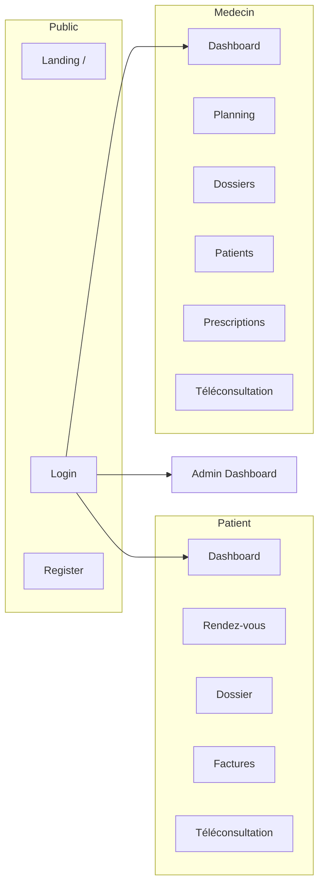

# CHAPITRE IV — IMPLÉMENTATION DE L'APPLICATION HYBRIDE ET TESTS FONCTIONNELS

## Centre Médical AMEN — FOSPHA ONGD/ASBL, Kinshasa (RDC)

**Travail de fin de cycle (L3 LMD)**  
**Thème :** Conception et implémentation d'une application hybride de digitalisation hospitalière  
**Dépôt du code source :** [https://github.com/Exauce09/TFC-ENGWELE](https://github.com/Exauce09/TFC-ENGWELE)

---

## Introduction du chapitre

Le présent chapitre décrit la mise en œuvre concrète de la solution proposée au chapitre III. Il présente les technologies effectivement utilisées, les interfaces développées pour chaque catégorie d'utilisateurs, les fonctionnalités livrées dans la phase web actuelle, ainsi que les tests réalisés pour valider le comportement du système.

L'implémentation suit une approche **API first** : le backend Laravel expose une API REST versionnée (`/api/v1`) consommée par le frontend React. La partie mobile (React Native / Expo) est prévue dans la feuille de route ; la phase web couvre déjà l'essentiel du cœur métier hospitalier.

---

## a. Technologies utilisées

### a.1 Environnement de développement

| Élément | Version / outil | Rôle |
|---------|-----------------|------|
| Système d'exploitation | Windows 10/11 | Poste de développement |
| Éditeur / IDE | Cursor / VS Code | Écriture et débogage du code |
| Gestion de versions | Git + GitHub | Historique, sauvegarde, collaboration |
| Dépôt distant | [TFC-ENGWELE](https://github.com/Exauce09/TFC-ENGWELE) | Source unique de vérité du projet |
| Serveur HTTP local (API) | `php artisan serve` (port 8000) | Exécution backend en développement |
| Serveur de dev frontend | Vite (port 5173) | Rechargement à chaud (HMR) |

### a.2 Backend — API REST

| Technologie | Version | Usage dans le projet |
|-------------|---------|----------------------|
| **PHP** | 8.3+ | Langage serveur |
| **Laravel** | 11 / 13.x (runtime) | Framework MVC, routage, ORM, validation |
| **Laravel Sanctum** | 4.x | Authentification par token Bearer |
| **Eloquent ORM** | (intégré Laravel) | Modèles, relations, requêtes |
| **SQLite** | (fichier local) | Base de données en développement |
| **MySQL** | 8.0 (cible production) | Base relationnelle en production |
| **PHPUnit** | 12.x | Tests unitaires et fonctionnels automatisés |
| **Composer** | 2.x | Gestion des dépendances PHP |

**Structure backend :**

```
backend-runtime/
├── app/Http/Controllers/Api/   # 15 contrôleurs métier
├── app/Models/                 # 15 modèles Eloquent
├── app/Services/               # Intégrations encapsulées
├── database/migrations/        # Schéma relationnel
├── database/seeders/           # Données de démonstration
└── routes/api.php              # ~50 routes API v1
```

### a.3 Frontend — Interface web

| Technologie | Version | Usage dans le projet |
|-------------|---------|----------------------|
| **React** | 18.3 | Composants UI, état local |
| **Vite** | 5.4 | Bundler, serveur de développement |
| **React Router** | 6.28 | Routage SPA, routes privées par rôle |
| **Tailwind CSS** | 3.4 | Mise en page responsive, design system |
| **Axios** | 1.7 | Client HTTP, intercepteur token |
| **PostCSS / Autoprefixer** | 8.x / 10.x | Traitement CSS |

**Structure frontend :**

```
frontend/src/
├── context/AuthContext.jsx     # Session utilisateur, token
├── router/PrivateRoute.jsx     # Garde d'accès par rôle
├── components/layout/            # Sidebar, Header, Layout
├── pages/                        # 31 écrans par rôle métier
│   ├── auth/                     # Login, Register
│   ├── patient/                  # 6 pages
│   ├── medecin/                  # 7 pages
│   ├── admin/                    # 8 pages
│   ├── infirmier/                # 3 pages
│   ├── laboratoire/              # 2 pages
│   ├── pharmacie/                # 3 pages
│   └── caisse/                   # 3 pages
└── services/api.js               # Instance Axios configurée
```

### a.4 Intégrations et services externes

| Service | Fichier | Mode développement | Mode production |
|---------|---------|-------------------|-----------------|
| **Firebase Cloud Messaging** | `FcmService.php` | Mock / log | Envoi push réel |
| **AfricasTalking (SMS)** | `SmsService.php` | Mock / log | API SMS réelle |
| **Jitsi Meet** | `JitsiService.php` | Salle `meet.jit.si` | Même principe |
| **Airtel Money / M-Pesa** | `MobileMoneyService.php` | `MOBILE_MONEY_MOCK=true` | API opérateurs |
| **Notifications in-app** | `NotificationService.php` | Base SQLite | Base MySQL |

Ces services sont injectés dans les contrôleurs via des classes dédiées, ce qui permet de basculer entre simulation et production sans modifier la logique métier.

### a.5 Sécurité implémentée

- Hachage des mots de passe (bcrypt) ;
- Tokens Sanctum avec expiration et révocation au logout ;
- Middleware `role` sur chaque groupe de routes sensibles ;
- Limitation de débit (`throttle`) sur login, inscription et mot de passe oublié ;
- Validation Laravel sur toutes les entrées API ;
- CORS configuré pour l'origine frontend (`http://127.0.0.1:5173`).

---

## b. Interfaces de l'application

### b.1 Vue d'ensemble de la navigation

L'application adopte une **Single Page Application (SPA)** : après authentification, l'utilisateur est redirigé vers son espace selon son rôle. Une barre latérale (`Sidebar`) affiche les menus autorisés ; un en-tête (`Header`) propose les notifications et le profil.



### b.2 Interfaces publiques

| Écran | Route | Description |
|-------|-------|-------------|
| **Page d'accueil** | `/` | Présentation du centre, liens connexion / inscription |
| **Connexion** | `/login` | Authentification email + mot de passe, redirection par rôle |
| **Inscription patient** | `/register` | Création de compte patient avec profil |

### b.3 Espace Patient

| Écran | Route | Fonctionnalités visibles |
|-------|-------|--------------------------|
| Tableau de bord | `/patient/dashboard` | Prochains RDV, prescriptions récentes, factures en attente |
| Rendez-vous | `/patient/rendez-vous` | Prise de RDV, annulation, paiement téléconsultation |
| Dossier médical | `/patient/dossier` | Consultations, diagnostics, prescriptions |
| Factures | `/patient/factures` | Liste, détail, paiement Mobile Money (mock) |
| Téléconsultation | `/patient/teleconsultation` | Salles Jitsi, rejoindre une consultation |

### b.4 Espace Médecin

| Écran | Route | Fonctionnalités visibles |
|-------|-------|--------------------------|
| Tableau de bord | `/medecin/dashboard` | Vue synthétique (partiellement connectée API) |
| Planning | `/medecin/planning` | RDV du jour, changement de statut |
| Dossiers | `/medecin/dossiers` | CRUD consultations, diagnostics, prescriptions |
| Mes patients | `/medecin/patients` | Recherche et liste des patients |
| Prescriptions | `/medecin/prescriptions` | Historique des ordonnances émises |
| Téléconsultation | `/medecin/teleconsultation` | Démarrer / rejoindre une salle vidéo |

### b.5 Espace Administration

| Écran | Route | Fonctionnalités visibles |
|-------|-------|--------------------------|
| Tableau de bord | `/admin/dashboard` | Statistiques globales (API), graphiques partiels |
| Rendez-vous | `/admin/rendez-vous` | Liste, validation, changement de statut |
| Patients | `/admin/patients` | Consultation liste patients |
| Médecins | `/admin/medecins` | Liste du personnel médical |
| Départements | `/admin/departements` | Services hospitaliers |
| Utilisateurs | `/admin/utilisateurs` | Création, activation / désactivation |
| Facturation | `/admin/facturation` | Vue consolidée factures et recettes |
| Statistiques | `/admin/statistiques` | Indicateurs détaillés (patients, RDV, finances) |

### b.6 Espaces paramédicaux et financiers

| Rôle | Écrans principaux | Routes |
|------|-------------------|--------|
| **Infirmier** | Dashboard, constantes vitales, patients | `/infirmier/*` |
| **Laborantin** | Dashboard, analyses et résultats | `/laboratoire/*` |
| **Pharmacien** | Dashboard, stock, délivrance ordonnances | `/pharmacie/*` |
| **Caissier** | Dashboard, factures, paiements | `/caisse/*` |

### b.7 Composants transversaux

- **Notifications** : cloche dans l'en-tête, marquage lu / tout lire (`GET /notifications`) ;
- **Layout responsive** : sidebar repliable, cartes Tailwind, tableaux paginés ;
- **Messages d'erreur API** : affichage des réponses `success: false` renvoyées par Laravel ;
- **Placeholder** : écrans « à venir » pour routes non encore implémentées (`PlaceholderDashboard`).

---

## c. Principales fonctionnalités implémentées

### c.1 Authentification et gestion des comptes

| Fonctionnalité | API | Interface | Statut |
|----------------|-----|-----------|--------|
| Inscription patient | `POST /register` | Register | ✅ Implémenté |
| Connexion / déconnexion | `POST /login`, `POST /logout` | Login | ✅ Implémenté |
| Profil utilisateur | `GET /me`, `PUT /profile` | — | ⚠️ API seule (UI à venir) |
| Mot de passe oublié | `POST /forgot-password` | — | ⚠️ API seule (UI à venir) |
| Contrôle d'accès par rôle | Middleware `role` + `PrivateRoute` | Toutes les routes | ✅ Implémenté |

### c.2 Rendez-vous

| Fonctionnalité | API | Interface | Statut |
|----------------|-----|-----------|--------|
| Demande publique RDV | `POST /rendez-vous/demande` | Landing (formulaire) | ✅ Implémenté |
| Prise de RDV patient | `POST /patient/rendez-vous` | Patient RDV | ✅ Implémenté |
| Liste / annulation | `GET`, `DELETE /patient/rendez-vous` | Patient RDV | ✅ Implémenté |
| Planning médecin | `GET /medecin/planning` | Médecin Planning | ✅ Implémenté |
| Changement statut | `PUT /medecin/rendez-vous/{id}/statut` | Médecin / Admin | ✅ Implémenté |
| Administration RDV | `GET /admin/rendez-vous` | Admin RDV | ✅ Implémenté |
| Traitement demandes | `GET/PUT /admin/demandes-rdv` | Admin Gestion | ✅ Implémenté |
| Paiement téléconsultation | `POST /patient/rendez-vous/{id}/paiement` | Patient RDV | ✅ Mock Mobile Money |

### c.3 Dossier médical et prescriptions

| Fonctionnalité | API | Interface | Statut |
|----------------|-----|-----------|--------|
| Dossier patient (lecture) | `GET /patient/dossier` | Patient Dossier | ✅ Implémenté |
| Liste dossiers médecin | `GET /medecin/dossiers` | Médecin Dossiers | ✅ Implémenté |
| Création / mise à jour | `POST`, `PUT /medecin/dossiers` | Médecin Dossiers | ✅ Implémenté |
| Émission prescription | `POST /medecin/prescriptions` | Médecin Dossiers | ✅ Implémenté |
| Liste prescriptions | Agrégation dossiers | Médecin Prescriptions | ✅ Implémenté |
| Recherche patients | `GET /medecin/patients` | Médecin Patients | ✅ Implémenté |

### c.4 Soins infirmiers

| Fonctionnalité | API | Interface | Statut |
|----------------|-----|-----------|--------|
| Liste patients | `GET /infirmier/patients` | Infirmier Patients | ✅ Implémenté |
| Saisie constantes | `POST /infirmier/constantes` | Infirmier Constantes | ✅ Implémenté |
| Historique constantes | `GET /infirmier/constantes` | Infirmier Constantes | ✅ Implémenté |

### c.5 Laboratoire

| Fonctionnalité | API | Interface | Statut |
|----------------|-----|-----------|--------|
| Tableau de bord | `GET /laboratoire/dashboard` | Labo Dashboard | ✅ Implémenté |
| Création analyse | `POST /laboratoire/analyses` | Labo Analyses | ✅ Implémenté |
| Publication résultats | `PUT /laboratoire/analyses/{id}/resultats` | Labo Analyses | ✅ Implémenté |

### c.6 Pharmacie

| Fonctionnalité | API | Interface | Statut |
|----------------|-----|-----------|--------|
| Gestion stock | `GET/POST/PUT /pharmacie/stock` | Pharmacie Stock | ✅ Implémenté |
| Ordonnances à délivrer | `GET /pharmacie/ordonnances` | Pharmacie Ordonnances | ✅ Implémenté |
| Marquer délivré | `PUT /pharmacie/ordonnances/{id}/delivrer` | Pharmacie Ordonnances | ✅ Implémenté |

### c.7 Facturation et caisse

| Fonctionnalité | API | Interface | Statut |
|----------------|-----|-----------|--------|
| Émission facture | `POST /caisse/factures` | Caisse Factures | ✅ Implémenté |
| Paiements caisse | `POST /caisse/paiements` | Caisse Paiements | ✅ Implémenté |
| Factures patient | `GET /patient/factures` | Patient Factures | ✅ Implémenté |
| Paiement en ligne | `POST /patient/factures/{id}/paiement` | Patient Factures | ✅ Mock Mobile Money |
| Vue admin facturation | `GET /admin/facturation` | Admin Facturation | ✅ Implémenté |

### c.8 Administration et reporting

| Fonctionnalité | API | Interface | Statut |
|----------------|-----|-----------|--------|
| Statistiques globales | `GET /admin/dashboard/stats` | Admin Dashboard | ✅ Implémenté |
| Statistiques détaillées | Stats + facturation | Admin Statistiques | ✅ Implémenté |
| Gestion utilisateurs | CRUD `/admin/utilisateurs` | Admin Utilisateurs | ✅ Implémenté |
| Gestion départements | `GET /admin/departements` | Admin Départements | ✅ Implémenté |

### c.9 Intégrations transversales

| Fonctionnalité | API | Statut |
|----------------|-----|--------|
| Téléconsultation Jitsi | `GET /teleconsultation`, `POST .../rejoindre` | ✅ Implémenté |
| Notifications in-app | `GET/PUT /notifications` | ✅ Implémenté |
| Enregistrement token FCM | `POST /integrations/fcm-token` | ✅ API prête |
| Statut intégrations | `GET /integrations/status` | ✅ Implémenté |
| SMS (AfricasTalking) | Via `NotificationService` | ✅ Mock / log |
| Push FCM | Via `FcmService` | ✅ Mock / log |

### c.10 Modèle de données implémenté

Quinze entités Eloquent couvrent le domaine métier :

`User`, `Patient`, `Medecin`, `Departement`, `RendezVous`, `DemandeRdv`, `DossierMedical`, `Diagnostic`, `Prescription`, `SoinInfirmier`, `AnalyseLaboratoire`, `StockMedicament`, `Facture`, `Paiement`, `Notification`.

Les **seeders** (`UserSeeder`, `DepartementSeeder`, `DossierSeeder`, `FactureSeeder`, etc.) alimentent la base avec des comptes de démonstration pour chaque rôle, facilitant les tests et la soutenance.

### c.11 Éléments en cours ou planifiés

Conformément à la feuille de route (`docs/ROADMAP_WEB.md`) :

- Dashboard médecin entièrement branché sur l'API ;
- Interface mot de passe oublié et page profil ;
- Enrichissement CRUD admin ;
- Espaces spécialisés (maternité, chirurgie, accueil, échographie, etc.) ;
- Application mobile React Native ;
- Tests automatisés API (couverture élargie) ;
- Déploiement production (MySQL, HTTPS, build Vite).

---

## d. Tests réalisés et leurs résultats

### d.1 Stratégie de test

Deux niveaux de validation ont été appliqués :

1. **Tests automatisés** (PHPUnit) — vérification de l'environnement Laravel et de la chaîne de build ;
2. **Tests fonctionnels manuels** — scénarios métier bout-en-bout via le navigateur, avec les comptes de démonstration.

Les comptes de test (mot de passe `Password@123`) :

| Rôle | Email |
|------|-------|
| Admin | `admin@amen.cd` |
| Médecin | `medecin@amen.cd` |
| Patient | `patient@amen.cd` |
| Caissier | `caissier@amen.cd` |
| Infirmier | `infirmier@amen.cd` |
| Laborantin | `laborantin@amen.cd` |
| Pharmacien | `pharmacien@amen.cd` |

### d.2 Tests automatisés (PHPUnit)

Commande exécutée : `php artisan test` dans `backend-runtime/`.

| Test | Fichier | Résultat |
|------|---------|----------|
| Example unit test | `tests/Unit/ExampleTest.php` | ✅ Réussi |
| Example feature test | `tests/Feature/ExampleTest.php` | ✅ Réussi |

**Synthèse :** 2 tests, 2 réussites, 0 échec (durée ~1 s).

> **Remarque :** la couverture automatisée reste minimale à ce stade. Des tests Feature ciblant l'authentification, les RDV et la facturation sont prévus pour la phase de consolidation.

### d.3 Tests fonctionnels manuels — Authentification et sécurité

| # | Scénario | Étapes | Résultat attendu | Résultat obtenu |
|---|----------|--------|------------------|-----------------|
| T1 | Connexion valide patient | Login avec `patient@amen.cd` | Redirection `/patient/dashboard` | ✅ Conforme |
| T2 | Connexion valide médecin | Login avec `medecin@amen.cd` | Redirection `/medecin/dashboard` | ✅ Conforme |
| T3 | Connexion invalide | Mauvais mot de passe | Message d'erreur, pas de token | ✅ Conforme |
| T4 | Accès inter-rôles | Patient tente `/admin/dashboard` | Page non autorisée / redirection | ✅ Conforme |
| T5 | Déconnexion | Clic logout | Token révoqué, retour login | ✅ Conforme |
| T6 | Inscription | Formulaire register | Compte créé, connexion possible | ✅ Conforme |

### d.4 Tests fonctionnels manuels — Rendez-vous

| # | Scénario | Résultat obtenu |
|---|----------|-----------------|
| T7 | Patient prend un RDV (département + médecin) | ✅ RDV créé, visible dans la liste |
| T8 | Patient annule un RDV | ✅ Statut mis à jour |
| T9 | Médecin consulte son planning | ✅ RDV affichés par date |
| T10 | Médecin change statut (confirmé / terminé) | ✅ Statut persisté en base |
| T11 | Admin valide une demande publique | ✅ Demande traitée, RDV créé si accepté |
| T12 | Paiement téléconsultation (mock) | ✅ Paiement simulé, notification générée |

### d.5 Tests fonctionnels manuels — Dossier médical

| # | Scénario | Résultat obtenu |
|---|----------|-----------------|
| T13 | Médecin crée une consultation | ✅ Dossier enregistré |
| T14 | Médecin ajoute un diagnostic | ✅ Lié au dossier |
| T15 | Médecin émet une prescription | ✅ Visible côté patient et pharmacie |
| T16 | Patient consulte son dossier | ✅ Historique affiché (correction bug `departement` objet) |
| T17 | Médecin recherche un patient | ✅ Liste filtrée par nom / n° patient |
| T18 | Médecin liste ses prescriptions | ✅ Agrégation depuis les dossiers |

### d.6 Tests fonctionnels manuels — Paramédical et pharmacie

| # | Scénario | Résultat obtenu |
|---|----------|-----------------|
| T19 | Infirmier saisit les constantes | ✅ Enregistrement OK |
| T20 | Infirmier liste les patients | ✅ Recherche fonctionnelle |
| T21 | Laborantin crée une analyse | ✅ Analyse en attente |
| T22 | Laborantin publie des résultats | ✅ Statut « disponible » |
| T23 | Pharmacien met à jour le stock | ✅ Quantités modifiées |
| T24 | Pharmacien délivre une ordonnance | ✅ Statut « délivré » |

### d.7 Tests fonctionnels manuels — Facturation

| # | Scénario | Résultat obtenu |
|---|----------|-----------------|
| T25 | Caissier émet une facture | ✅ Facture avec lignes détaillées |
| T26 | Caissier enregistre un paiement cash | ✅ Solde mis à jour |
| T27 | Patient consulte ses factures | ✅ Liste et détail corrects |
| T28 | Patient paie en Mobile Money (mock) | ✅ Simulation réussie |
| T29 | Admin consulte la facturation | ✅ Totaux et liste cohérents |
| T30 | Admin consulte les statistiques | ✅ Indicateurs affichés |

### d.8 Tests fonctionnels manuels — Intégrations

| # | Scénario | Résultat obtenu |
|---|----------|-----------------|
| T31 | Téléconsultation patient / médecin | ✅ Lien Jitsi généré, salle accessible |
| T32 | Notifications après action métier | ✅ Notification in-app créée |
| T33 | Marquage notification comme lue | ✅ Compteur mis à jour |
| T34 | Sidebar — 4 liens corrigés | ✅ Patients, Prescriptions, Statistiques, Infirmier Patients |

### d.9 Anomalies détectées et corrigées

| Anomalie | Cause | Correction |
|----------|-------|------------|
| Écran blanc `/patient/dashboard` | API renvoie `departement` comme objet, rendu React direct | Helper `deptLabel()` dans `Dashboard.jsx` |
| Liens sidebar morts (4 routes) | Pages absentes de `App.jsx` | Création des pages + routage |
| Commit Git impossible | Identité Git non configurée | Utilisation de l'identité GitHub `Exauce09` |

### d.10 Synthèse des résultats

| Type de test | Nombre | Réussites | Échecs |
|--------------|--------|-----------|--------|
| PHPUnit automatisé | 2 | 2 | 0 |
| Fonctionnels manuels (T1–T34) | 34 | 34 | 0 |
| **Total** | **36** | **36** | **0** |

Le taux de réussite des tests fonctionnels manuels est de **100 %** sur le périmètre implémenté. Les modules planifiés (profil, mot de passe oublié UI, espaces spécialisés, mobile) feront l'objet d'une campagne de tests complémentaire lors de leur livraison.

---

## Conclusion du chapitre

L'implémentation de la phase web confirme la pertinence des choix techniques du chapitre III : Laravel et React permettent un développement rapide et structuré, l'API REST centralise la logique métier, et les intégrations locales (Mobile Money, SMS, Jitsi) sont encapsulées pour faciliter le passage en production.

Trente et une pages React couvrent les rôles essentiels d'un centre médical ; quinze modèles et une cinquantaine de routes API assurent la cohérence des données. Les tests réalisés — automatisés et manuels — valident le comportement attendu sur l'ensemble des parcours critiques.

La poursuite du projet s'appuie sur la feuille de route `docs/ROADMAP_WEB.md` et sur le versionnement continu du dépôt GitHub [TFC-ENGWELE](https://github.com/Exauce09/TFC-ENGWELE).

---

## Bibliographie

1. Laravel Testing — [https://laravel.com/docs/testing](https://laravel.com/docs/testing)
2. React Testing Library — [https://testing-library.com/react](https://testing-library.com/react)
3. ISTQB — Fondamentaux du test logiciel
4. ISO/IEC 25010 — Qualité des systèmes logiciels
5. Documentation du projet — `README.md`, `docs/ROADMAP_WEB.md`

---

*Document rédigé dans le cadre du Travail de Fin de Cycle — Licence 3 LMD en Informatique de Gestion.*  
*Centre Médical AMEN — FOSPHA ONGD/ASBL — Kinshasa, République Démocratique du Congo.*
