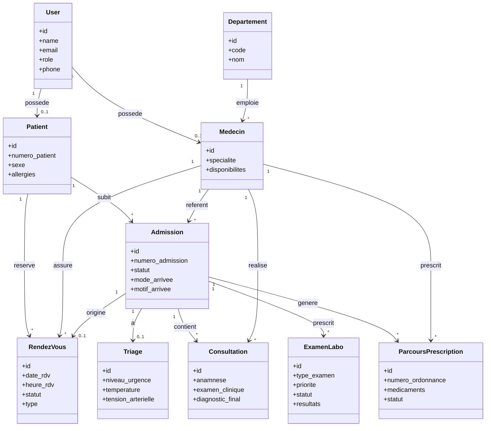
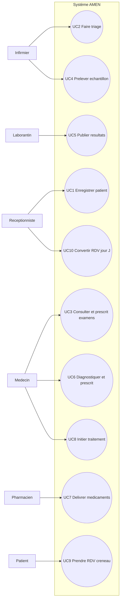
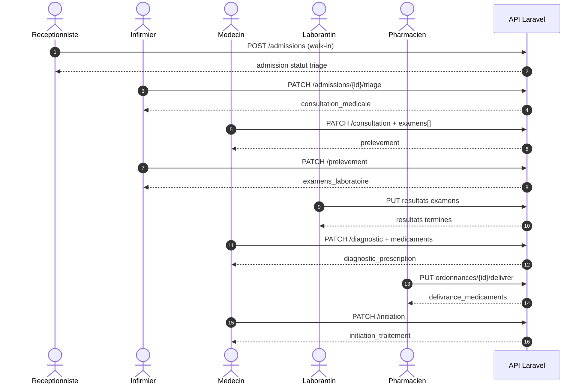
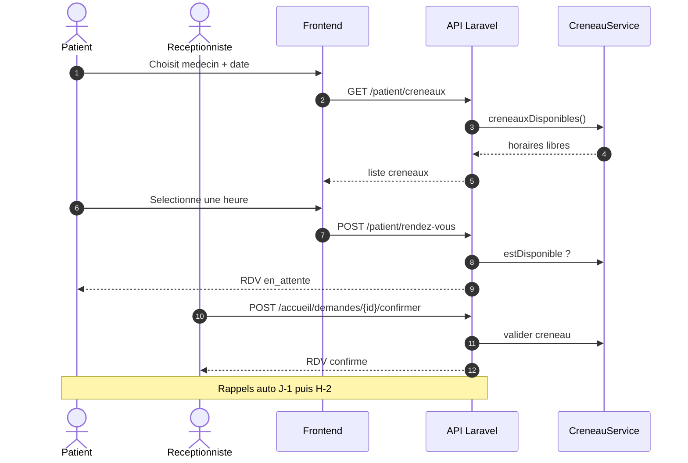
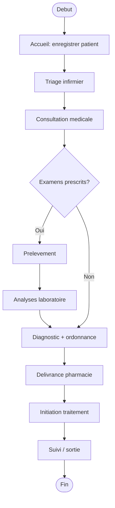
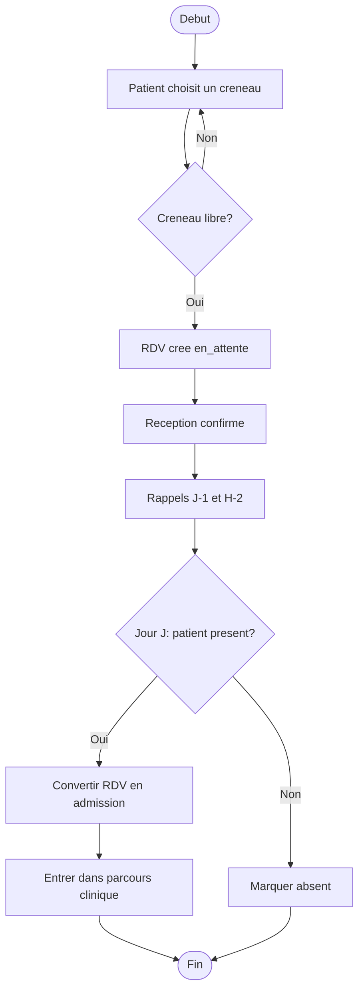

# Diagrammes UML — Centre Médical AMEN

À coller dans le mémoire (exporteruer Mermaid → PNG via [mermaid.live](https://mermaid.live) ou VS Code).

---

## 1. Diagramme de classes

---

## 2. Diagramme de cas d'utilisation

---

## 3. Diagrammes de séquence (2 scénarios)

### Scénario A — Patient walk-in jusqu'à l'initiation du traitement

### Scénario B — Patient réserve un créneau RDV

---

## 4. Diagrammes d'activités (2 scénarios)

### Scénario A — Parcours clinique Accueil → Traitement

### Scénario B — Gestion d'un rendez-vous (création → jour J)

---

## Légende courte (mémoire)

| Diagramme | Rôle |
|-----------|------|
| **Classes** | Structure des données du parcours (Admission au centre) |
| **Cas d'utilisation** | Interactions acteurs ↔ système (UC1–UC10) |
| **Séquence A** | Collaboration temps réel walk-in → initiation |
| **Séquence B** | Collaboration prise et confirmation de RDV |
| **Activité A** | Enchaînement des étapes métier cliniques |
| **Activité B** | Enchaînement RDV jusqu'au jour J |
