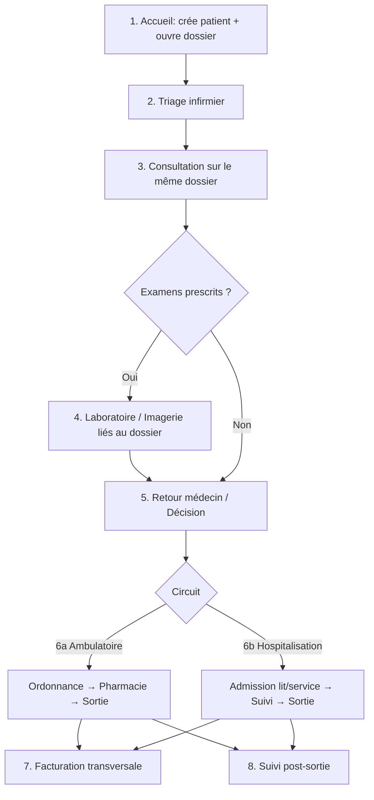

# Procédure d'arrivée du patient — Centre Médical AMEN

Procédure clinique orchestrée dans le système, **depuis l'arrivée du patient** jusqu'au suivi post-sortie.

## Règle d'or

**Seul l'accueil / réception** :
1. crée le **patient** (s'il n'existe pas encore) ;
2. **ouvre le dossier médical** (`DOS-…`) ;
3. démarre l'**épisode de soins** (`EPS-…`) lié à ce dossier.

Triage, médecin, labo, pharmacie et caisse **travaillent sur ce même dossier** — ils ne créent ni patient ni dossier.

## Schéma global

## Étapes dans le système

| # | Étape | Rôle | Où dans l'app |
|---|--------|------|----------------|
| 1 | Accueil : patient + dossier | Réceptionniste | `/accueil/arrivee` |
| 2 | Triage (constantes + urgence) | Infirmier | `/infirmier/triage` |
| 3 | Consultation (complète le dossier) | Médecin | `/medecin/dossiers` + `/medecin/parcours` |
| 4 | Labo / Imagerie | Laborantin / Échographiste | `/laboratoire/*`, `/echographie/*` |
| 5 | Décision finale | Médecin | `/medecin/parcours` |
| 6a | Ambulatoire | Médecin + Pharmacien | Ordonnance → `/pharmacie/ordonnances` |
| 6b | Hospitalisation | Médecin | Admission lit/service via parcours |
| 7 | Facturation | Caisse (auto + manuel) | Lignes créées à chaque étape + `/caisse/*` |
| 8 | Suivi post-sortie | Médecin / Accueil | Date de suivi prévue sur l'épisode |

## Objet métier : `episodes_soins`

Chaque arrivée crée un **épisode de soins** (`EPS-YYYYMMDD-####`) qui porte :
- l'étape courante
- le niveau d'urgence (après triage)
- le circuit (ambulatoire / hospitalisation)
- le lien éventuel vers le dossier médical
- les dates d'admission / sortie / suivi

## API principales

| Action | Méthode | Route |
|--------|---------|-------|
| Enregistrer arrivée | `POST` | `/api/v1/accueil/episodes/arrivee` |
| File triage | `GET` | `/api/v1/infirmier/file-triage` |
| Valider triage | `POST` | `/api/v1/infirmier/episodes/{id}/triage` |
| File consultation | `GET` | `/api/v1/medecin/file-consultation` |
| Décision | `POST` | `/api/v1/medecin/episodes/{id}/decision` |
| Avancer étape | `PUT` | `/api/v1/medecin/episodes/{id}/avancer` |

## Niveaux d'urgence (triage)

- **critique** (rouge)
- **urgent** (orange)
- **moins_urgent** (jaune)
- **non_urgent** (vert)

## Facturation transversale

À chaque étape clé, une facture liée à l'épisode peut être générée automatiquement :
- Accueil / enregistrement
- Triage / constantes
- Décision ambulatoire ou admission hospitalisation

Le caissier finalise les encaissements dans l'espace Caisse.

---

*Centre Médical AMEN — Avenue Vitamine 1, n° 36 D/Bis, Matete, Kinshasa*
