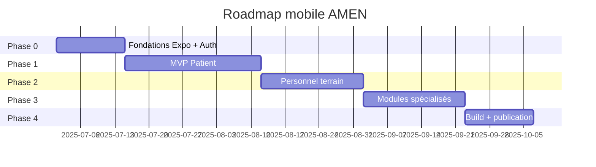

# Feuille de route — Application mobile (Centre Médical AMEN)

> **Règle :** tout développement est versionné sur GitHub  
> Dépôt : [https://github.com/Exauce09/TFC-ENGWELE](https://github.com/Exauce09/TFC-ENGWELE)  
> **Prérequis :** phase web terminée ([ROADMAP_WEB.md](./ROADMAP_WEB.md))

## Objectif

Développer une **application mobile** (React Native / Expo) connectée à la **même API** `/api/v1` que le web. L'API first évite de dupliquer la logique métier : le mobile consomme les endpoints Laravel existants.

## Stratégie par phases

| Phase | Cible | Priorité | Rôles |
|-------|--------|----------|-------|
| **MVP** | Patients | Haute | `patient` |
| **2** | Personnel terrain | Moyenne | `medecin`, `infirmier`, `receptionniste` |
| **3** | Spécialités + admin léger | Basse | `sage_femme`, `laborantin`, etc. |
| **4** | Publication stores | Finale | Tous |

Le **MVP patient** couvre 80 % de la valeur mobile (RDV, factures, notifications, téléconsultation).

---

## Stack technique

| Composant | Choix | Rôle |
|-----------|-------|------|
| Framework | **Expo SDK 52+** | Build Android/iOS, OTA updates |
| UI | React Native + **NativeWind** ou **React Native Paper** | Cohérence visuelle AMEN |
| Navigation | **Expo Router** (file-based) | Onglets + stacks par rôle |
| HTTP | **Axios** | Même pattern que `frontend/src/services/api.js` |
| Auth | **Laravel Sanctum** (Bearer token) | `POST /login`, token stocké sécurisé |
| Stockage token | **expo-secure-store** | Pas de AsyncStorage pour le token |
| Notifications | **expo-notifications** + FCM | `POST /integrations/fcm-token` |
| Téléconsultation | **WebView** ou lien Jitsi | `GET /teleconsultation`, `POST .../rejoindre` |
| Paiement | API existante Mobile Money | `POST /patient/factures/{id}/paiement` |

## Structure cible du dépôt

```
hopital-amen/
├── backend-runtime/     # API (inchangée)
├── frontend/            # Web (inchangé)
├── mobile/              # ← nouveau dossier Expo
│   ├── app/               # Expo Router (écrans)
│   ├── src/
│   │   ├── context/       # AuthContext
│   │   ├── services/      # api.js
│   │   ├── components/
│   │   └── hooks/
│   ├── app.json
│   └── package.json
├── start-mobile.ps1       # Script de lancement dev
└── docs/
    └── ROADMAP_MOBILE.md  # Ce fichier
```

---

## Ordre de réalisation

### Phase 0 — Fondations

| # | Tâche | Statut |
|---|--------|--------|
| 0 | Initialiser projet Expo (`mobile/`) + Expo Router | ✅ |
| 0b | Service API Axios + variables `EXPO_PUBLIC_API_URL` | ✅ |
| 0c | AuthContext (login, logout, token SecureStore, `/me`) | ✅ |
| 0d | Écrans Login + Register + mot de passe oublié | ✅ |
| 0e | Navigation protégée par rôle (garde comme `PrivateRoute`) | ✅ |
| 0f | Script `start-mobile.ps1` + doc dans README | ✅ |

**API utilisée :** `POST /login`, `POST /logout`, `GET /me`, `PUT /profile`, `POST /register`, `POST /forgot-password`

---

### Phase 1 — MVP Patient (priorité haute)

| # | Tâche | Statut | API |
|---|--------|--------|-----|
| 1 | Dashboard patient (résumé RDV, factures, notifications) | ✅ | `GET /patient/dashboard` |
| 2 | Liste et détail des rendez-vous | ⏳ | `GET /patient/rendez-vous` |
| 3 | Prise de RDV (département, médecin, créneau) | ⏳ | `GET /departements`, `GET /medecins`, `POST /patient/rendez-vous` |
| 4 | Annulation RDV | ⏳ | `DELETE /patient/rendez-vous/{id}` |
| 5 | Mon dossier médical (lecture seule) | ⏳ | `GET /patient/dossier` |
| 6 | Mes prescriptions | ⏳ | `GET /patient/prescriptions` |
| 7 | Factures + détail + paiement Mobile Money | ⏳ | `GET /patient/factures`, `POST .../paiement` |
| 8 | Centre de notifications in-app | ⏳ | `GET /notifications`, `PUT .../lu` |
| 9 | Push notifications (FCM token) | ⏳ | `POST /integrations/fcm-token` |
| 10 | Téléconsultation (rejoindre salle Jitsi) | ⏳ | `GET /teleconsultation`, `POST .../rejoindre` |
| 11 | Page profil (modifier nom, téléphone, mot de passe) | ⏳ | `PUT /profile` |

**Écrans cibles (onglets patient) :**

```
Accueil | RDV | Factures | Profil
```

---

### Phase 2 — Personnel terrain

| # | Tâche | Statut | Rôles | API |
|---|--------|--------|-------|-----|
| 12 | Dashboard médecin (RDV du jour, stats) | ⏳ | médecins | `GET /medecin/dashboard` |
| 13 | Planning et liste patients médecin | ⏳ | médecins | `GET /medecin/planning`, `/patients` |
| 14 | Consultation dossier + prescription rapide | ⏳ | médecins | `GET/POST /medecin/dossiers`, `POST /prescriptions` |
| 15 | Mise à jour statut RDV (confirmé, terminé) | ⏳ | médecins | `PUT /medecin/rendez-vous/{id}/statut` |
| 16 | Infirmier : liste patients + saisie constantes | ⏳ | `infirmier` | `GET /infirmier/patients`, `POST /constantes` |
| 17 | Accueil : demandes RDV + validation | ⏳ | `receptionniste` | `GET /accueil/demandes`, `PUT .../traiter` |
| 18 | Accueil : file d'attente RDV du jour | ⏳ | `receptionniste` | `GET /accueil/rendez-vous` |

---

### Phase 3 — Spécialités et modules avancés

| # | Tâche | Statut | Module |
|---|--------|--------|--------|
| 19 | Maternité — suivis prénataux | ⏳ | `/maternite/*` |
| 20 | Laboratoire — analyses et résultats | ⏳ | `/laboratoire/*` |
| 21 | Pharmacie — stock et ordonnances | ⏳ | `/pharmacie/*` |
| 22 | Caisse — factures et paiements | ⏳ | `/caisse/*` |
| 23 | Admin — stats et alertes (lecture seule) | ⏳ | `GET /admin/dashboard/stats` |

> Les espaces chirurgie, écho, kiné, dentisterie restent **web-first** ; mobile optionnel selon besoin terrain.

---

### Phase 4 — Qualité, build et publication

| # | Tâche | Statut |
|---|--------|--------|
| 24 | Mode hors-ligne léger (cache RDV / profil) | ⏳ |
| 25 | Gestion erreurs réseau + retry (connexion variable Kinshasa) | ⏳ |
| 26 | Tests E2E (Detox ou Maestro) — flux login + RDV patient | ⏳ |
| 27 | Build Android (APK / AAB) via EAS Build | ⏳ |
| 28 | Build iOS (si compte Apple Developer) | ⏳ |
| 29 | Publication Play Store + fiche centre AMEN | ⏳ |
| 30 | Mise à jour chapitre TFC (implémentation mobile) | ⏳ |

---

## Configuration développement

### Variables d'environnement (`mobile/.env`)

```env
# Émulateur Android : 10.0.2.2 = localhost machine hôte
EXPO_PUBLIC_API_URL=http://10.0.2.2:8000/api/v1

# Appareil physique (même réseau Wi-Fi que le PC)
# EXPO_PUBLIC_API_URL=http://192.168.x.x:8000/api/v1

# Production
# EXPO_PUBLIC_API_URL=https://amen.votredomaine.cd/api/v1
```

### CORS backend

Ajouter l'origine Expo dans `backend-runtime/config/cors.php` :

```php
'allowed_origins' => [
    'http://localhost:5173',
    'http://localhost:5174',
    'http://localhost:8081',   // Metro bundler Expo
],
```

Pour un appareil physique, Sanctum Bearer token suffit (pas de cookie cross-origin).

### Lancement prévu

```powershell
.\start-backend.ps1
.\start-mobile.ps1    # à créer — expo start
```

---

## Cartographie API → écrans mobile

### Public (sans auth)

| Endpoint | Écran mobile |
|----------|--------------|
| `GET /departements` | Sélecteur département (prise RDV) |
| `GET /medecins` | Liste médecins |
| `POST /rendez-vous/demande` | Demande RDV sans compte (optionnel MVP) |

### Patient authentifié

| Endpoint | Écran |
|----------|-------|
| `GET /patient/dashboard` | Accueil |
| `GET /patient/rendez-vous` | Mes RDV |
| `POST /patient/rendez-vous` | Nouveau RDV |
| `GET /patient/dossier` | Dossier |
| `GET /patient/prescriptions` | Ordonnances |
| `GET /patient/factures` | Factures |
| `POST /patient/factures/{id}/paiement` | Payer |
| `GET /notifications` | Notifications |
| `GET /teleconsultation` | Téléconsultation |

---

## UX et contraintes terrain (Kinshasa)

| Contrainte | Réponse mobile |
|------------|----------------|
| Connexion instable | Indicateurs de chargement, messages clairs, retry |
| Paiement Mobile Money | Flux guidé Airtel / M-Pesa (mock puis prod) |
| Langue | Interface en français |
| Accessibilité | Textes lisibles, boutons larges, contrastes |
| Batterie / data | Listes paginées, images légères |

---

## Tests de validation mobile

| ID | Scénario | Résultat attendu |
|----|----------|------------------|
| M01 | Login patient | Token reçu, redirection accueil |
| M02 | Prendre un RDV | RDV visible dans la liste |
| M03 | Annuler un RDV | Statut « annulé » |
| M04 | Consulter facture impayée | Détail + bouton payer |
| M05 | Paiement mock | Statut facture mis à jour |
| M06 | Recevoir notification push | Token FCM enregistré |
| M07 | Rejoindre téléconsultation | Lien Jitsi ouvert |
| M08 | Logout | Token supprimé, retour login |

---

## Jalons recommandés



*Dates indicatives — à ajuster selon calendrier TFC / soutenance.*

---

## Documentation liée

| Document | Fichier |
|----------|---------|
| Feuille de route web | `docs/ROADMAP_WEB.md` |
| Chapitre IV — Implémentation | `docs/CHAPITRE_4_IMPLEMENTATION.md` |
| Guide production | `docs/PRODUCTION.md` |
| API routes | `backend-runtime/routes/api.php` |

## Comptes démo

`Password@123` — compte patient : `patient@amen.cd`  
Liste complète : `README.md` et écran Login web.

---

## Prochaine action

**Démarrer la phase 0** : initialiser le dossier `mobile/` avec Expo Router et brancher le login sur `POST /api/v1/login`.
